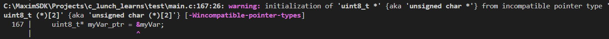
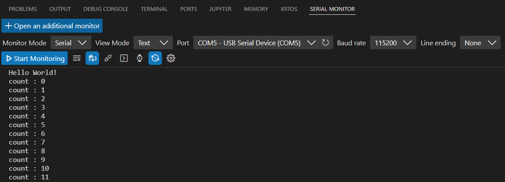
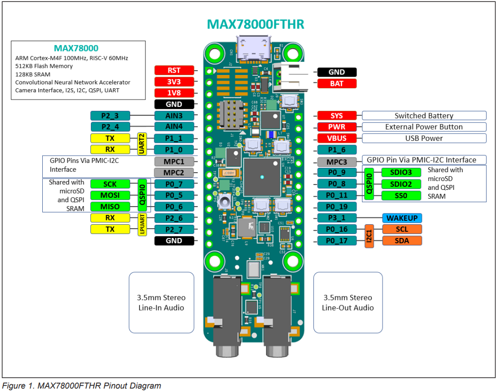
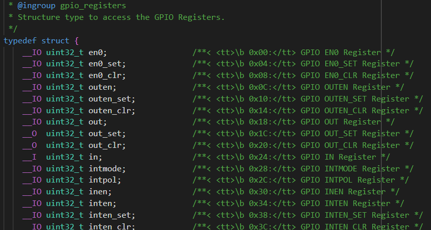
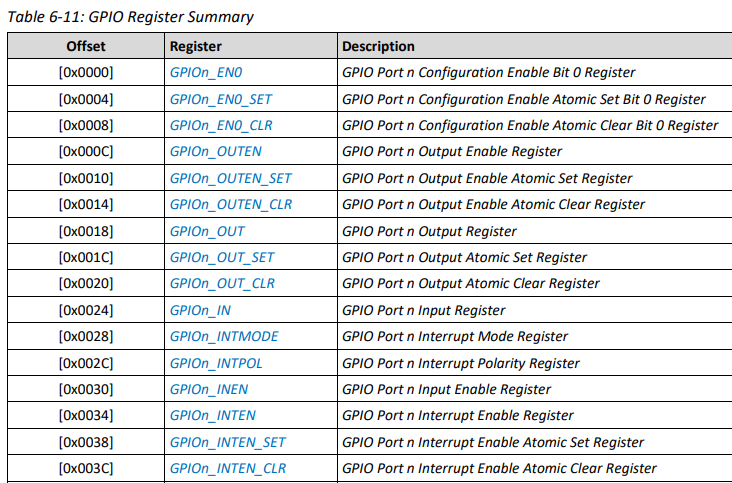
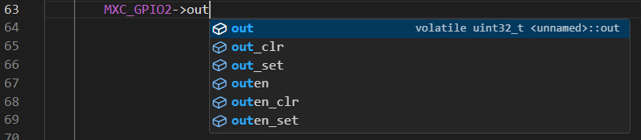
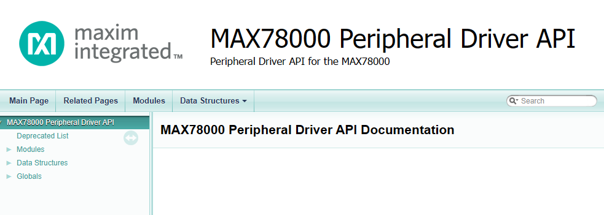
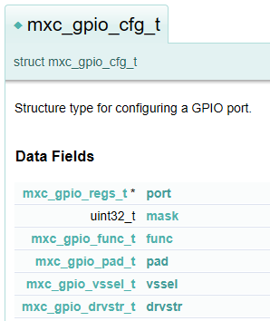
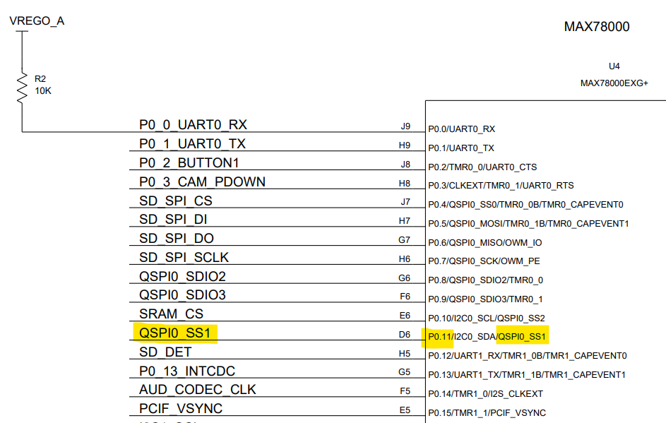
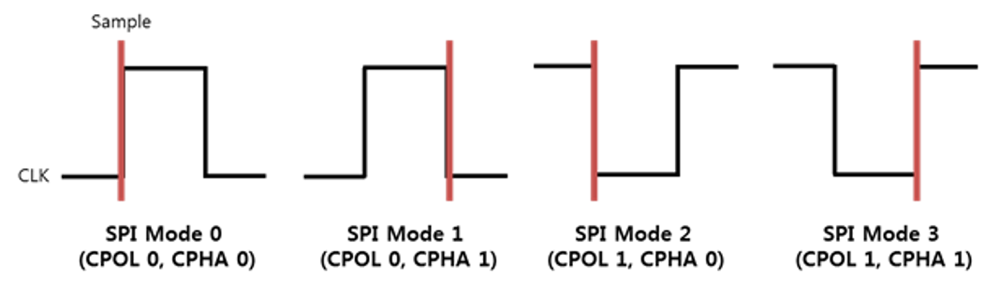

# ADI Microcontrollers Training

- [Day 0: Prerequisites](#Day%200%20C%20Programming%20&%20Microcontrollers%20Overview.md)
- [Day 1: Orientation](#Day%201%20Orientation)
	- [Day 1 - Labs](#Lab%20Flash%20&%20Run%20"Hello%20World")
- [Day 2:  Introduction to MSDK](#Day%202%20Introduction%20to%20MSDK)
	- [Lab: `GPIO` Example](#Lab%20`GPIO`%20Example)
	- [Lab: Documentation Hunt](#Lab%20Documentation%20Hunt)
- [Day 3: Using the Peripheral API (GPIO)](#Day%203)
	- [Lab: Accessing Memory with Structs](#Lab%20Accessing%20Memory%20with%20Structs)
	- [Lab: Working With A Peripheral (via API)](#Lab%20Working%20With%20A%20Peripheral%20(via%20API))
- [Day 4: Additional Peripherals (SPI)](#Day%204%20Additional%20Peripherals%20(ADC,%20SPI))
	- [Lab: SPI](#SPI)
- [Day 5: Under the Hood + Next Steps](#Day%205%20Under%20the%20Hood%20+%20Next%20Steps)

---

# Day 0: Course Preparation

To be completed prior to course start.

- [ ] Order [required hardware kits](#Required%20Hardware)
- [ ] Install & configure your [software environment](#Software%20Environment%20Setup)
- [ ] Complete this [C Prerequisite Check](C_Prerequisite_Assignment.c)

## Required Hardware

This course uses the following hardware:

- [MAX32670EVKIT](https://www.analog.com/en/design-center/evaluation-hardware-and-software/evaluation-boards-kits/max32670evkit.html) Microcontroller
- [MAX78000FTHR](https://www.analog.com/en/resources/evaluation-hardware-and-software/evaluation-boards-kits/max78000fthr.html) Microcontroller
- [MAX31723PMB1](https://www.analog.com/en/design-center/evaluation-hardware-and-software/evaluation-boards-kits/max31723pmb1.html) SPI Peripheral Temperature Sensor
- 10 Female-Female Jumper Cables
- USB-A ports or adapter

Please order these asap!

## Software Environment Setup

Please perform the following steps to configure the MSDK toolchain & environment:

1. Install the [Maxim SDK](https://analogdevicesinc.github.io/msdk/USERGUIDE/#download)
    1. Stick to the default setup options. (You probably won't need instructions for this part... but if you like documentation, see [the MSDK user guide](https://analogdevicesinc.github.io/msdk//USERGUIDE/#setup).)
    2. At the end of the install, a prompt will open to set up VS Code support. Ignore this / close it.
2. Install [Visual Studio Code](https://code.visualstudio.com/)
3. Integrate MSDK to VS Code ([follow these steps](https://analogdevicesinc.github.io/msdk//USERGUIDE/#setup-vs-code))
    1. Verify integration by successfully building the "Hello World" project in `Examples/MAX32670` 
4. Integrate MSDK to the command line ([follow these steps](https://analogdevicesinc.github.io/msdk//USERGUIDE/#getting-started-with-command-line-development))
    1. This should be quick. Make sure you verify the toolchain path by running the commands [in the "Verification" section](https://analogdevicesinc.github.io/msdk//USERGUIDE/#verification).
        1. You can compare your output to [this sample terminal output](assets/environment%20config%20sample%20terminal%20output.md).

## C Prerequisite Check

Download and complete this [C Prerequisite Check](C_Prerequisite_Assignment.c). 

Use an [online C compiler](https://www.onlinegdb.com/online_c_compiler) or [install the minGW-w64 toolchain for GCC](https://code.visualstudio.com/docs/cpp/config-mingw).

> [!warning]
> Use the MinGW64 backend instead of UCRT64 for your C runtime. To do this, follow all steps as in Microsoft's guide, except change the following command to read:
> 
>     pacman -S --needed base-devel mingw-w64-x86_64-toolchain
>     
> Your PATH variable will change accordingly to `"C:\msys64\mingw64\bin"`

---

# Day 1: Orientation

- [ ] Scheduling considerations for the course
- [ ] Review C Prerequisite assignment
- [ ] Microcontrollers Overview (Slides)

## Review of C Prerequisite Assignment

Test your code!
- Compile & run as you complete code.
- Make sure your code does what you expect. Predict its output and ensure the code agrees with your predictions. 

Do not tolerate compiler warnings!
- Fix warnings when they occur
- Most errors in submitted code were flagged by the compiler!

> [!tip]
> This section is long because it aims to address each part of the C assignment, and common errors that students may make. Feel free to skim the parts which are relevant to your performance on this task, or [skip ahead](#Slides%20Microcontrollers%20Overview) if you completed the file without issue.

### Data Types

Useful tool for bit manipulations: Windows Calculator (Programmer Mode)

#### Fixed-Width Types

Be explicit about your data types when working with bits! (E.g. addresses, registers, bytes, etc.)

Must `#include <stdint.h>`

Unsigned:
- `uint8_t`
- `uint16_t`
- `uint32_t`

Signed:
- `int8_t`
- `int16_t`
- `int32_t`

#### Arithmetic
Floating-point vs integer division:

```c
int divide_this = 4;

// Both numbers integers --> Integer result
divide_this / 3;         // 1

// Literal double / float
divide_this / 3.0        // 1.333
divide_this / 3.0f       // 1.333 (floats use the 'f' suffix)

// Cast any of the numbers to float
float(divide_this) / 3;  // 1.333
```

Note: Another common data type is the `unsigned long`, which is an integer of larger range than `int`. It can be written in shorthand as `UL` suffix to explicitly define the type, e.g. `#define BIT0 1UL`.

#### Casting

Note that `printf()` implicitly converts type to `double`.
```c
uint16_t x = 0x7EE1;
uint8_t x8 = (uint8_t)x8;    // Convert to 8-bit (Decimal: 225)
                             // Binary: 1110_0001
printf("As a signed number x8 = %d \n", x8); // Does not work as expected
                                             // Outputs 225
// Sign extended from unsigned (uint8_t) as 32-bit double:
// 0000_0000_0000_0000_0000_0000_1110_0001

printf("As a signed number x8 = %d \n", (int8_t)x8 ); // Outputs -31
// Sign extended from signed (int8_t) as 32-bit double:
// 1111_1111_1111_1111_1111_1111_1110_0001
```


### Bit Manipulations

#### Consider Using Hexadecimal Output
Recommend using hexadecimal output (`%x`) for bit manipulations. This is easier to follow than decimal, for example:

| Hex  | Binary      | Decimal |
| ---- | ----------- | ------- |
| 0xFE | `1111_1110` | 254     |
| 0x0E | `0000_1110` | 14      |

`0xFE` and `0x0E` look similar and form a clear relationship, whereas in decimal, it isn't clear how 254 and 14 relate.

#### Write Hex Values With Leading `0x`

Recommend writing hex values with a `0x` prefix to denote hexadecimal. Consider:

`The value of the variable is: 3003`

Depending on the `printf()` statement, this variable is either:
- 3003 (decimal)
- `0x3003` -> 12291 (decimal)

If we always prefix hexadecimal output with `0x`, we will always know the base.
```c
uint16_t knownValue = 0x3003;
printf("The value of this variable is: 0x%x \n", knownValue); // Prints 0x3003
printf("In decimal, this is %u \n", knownValue); // Prints 12291
```

#### Bit Set & Clear

This will be very important! Let's get good at setting and clearing individual / collections of bits.

```c
/* Setting Bits */

// Set bit 0
x = x | (0x01);

// Set bit 1
x = x | (0x01 << 1);

// Set bit 2
x = x | (0x01 << 2);

// Set bit 3
x = x | (0x01 << 3);

// In general: you can shift N positions to target that bit.

// You can even set multiple bits:

// Set bits 5 and 4
x = x | (0x03 << 4);   //  0x03        = 0000_0011
                       // (0x03 << 4)  = 0011_0000 


/* Clearing Bits */

// Clear bit 0
x = x & ~(0x01);        //   0x01  = 0000_0001
						// ~(0x01) = 1111_1110
						// It clears the bits you target in parenthesis.

// Clear bit 1
x = x & ~(0x01 << 1);    //  (0x01 << 1) = 0000_0010
                         // ~(0x01 << 1) = 1111_1101

// Clear bit 2
x = x & ~(0x01 << 2);

// Clear bits 5 and 4
x = x & ~(0x03 << 4);   //   0x03       = 0000_0011
						//  (0x03 << 4) = 0011_0000
						// ~(0x03 << 4) = 1100_1111
```

Specifying bit "sets" (`1`) and "clears" (`0`) as a single number (e.g. `1110_0011` to set bits 7, 6, 5, 1, and 0) is called a **mask**.

#### Compound Operators

Just as `i++` is shorthand for `i = i + 1`, we can use compound operators for bit manipulations.

```c
// Set bit 0
x = x | 0x01;   // Explicit
x |= 0x01;      // Implicit

// Set bit 4
x = x | (0x01 << 4); // Explicit
x |= (0x01 << 4);    // Implicit

// Clear bit 7
x = x & ~(0x01 << 7);  // Explicit
x &= ~(0x01 << 7);     // Implicit
```
### Arrays

#### Easier Initialization

Two ways to pre-initialize arrays to 0:

```c
// Mass initializations
int myArray[5] = {0};

// Individual initialization
int myArray2[5] = {0, 0, 0, 0, 0};
```


#### Char* From String

C processes strings and automatically converts them to arrays:
```c
char* word = "Hello";    // Stores as {'H', 'e', 'l', 'l', 'o'};`
```


#### You (Probably) Don't Want An Array Of Pointers

This code creates an array of `char` pointers, instead of the intended array of `char`:
```c
char* char_array[6] = "Hello";  // Creates an array of 5 char* (pointers to chars)
```

Either:

```c
char char_array1[6] = "Hello"; // Explicit array sizing — use this to make a larger array
char* char_array2 = "Hello";   // Implicitly sizes the array
```

### Pointers

#### Arrays as Pointers

This gives a warning:

```c
char myVar[] = {0xAA, 0x55};
uint8_t* myVar_ptr = &myVar; // No! Error!
```

`myVar` is an array, which C treats as a _pointer to_ the start of the array. For non-arrays, it would be correct to use `&` operator. With arrays, the correct way to do this is:

```c
// Method 1: myVar already points to the array 1st element!
uint8_t* myVar_ptr = myVar;

// Method 2: Get address of 1st element (which is also myVar)
uint8_t* myVar_ptr = &myVar[0];
```

The compiler warning indicates the problem, as well as how to fix it. (Don't ignore compiler warnings!)



#### Pointer Indexing

C indexes addresses by pointer size. Therefore, to move to the next element of an 8-bit array:

```c
uint8_t myArray[2] = {0x00, 0x01};
uint8_t* myPtr = myArray;  // Points to first memory address of myArray
myPtr = myPtr + 1; // Points to 2nd element of myArray

// For a memory representation:
// myPtr = &myArray[0] = 0x2334_1F72
// myPtr + 1 = &myArray[1] = 0x2334_1F7A

// This will not work properly
myPtr = myPtr + 8;
```

The only time you need to be explicit about the number of bits is when C does not know that it is dealing with a pointer:

```c
uint32_t myPtrVal = myArray;  // myPtr holds the integer value of myArray's address
myPtrVal = myPtrVal + 32;     // myPtr holds the integer value of myArray[2]'s address
uint32_t* myPtr = (uint32_t*)myPtrVal;   // Cast to pointer, points to myArray[2]
```

### Functions

Do not place functions inside of `main()` as such:

```c
/* DO NOT DO THIS!! */
int main()
{
	// Function definition inside of main()
	uint8_t isNonZero(uint32_t input) 
	{
		return (input !=0) ? 1 : 0;
	}
	printf("5 is non-zero?  %u \n", )
}
```

Instead, place functions above or below `main()`. 

```c
/* Function Prototype */
uint8_t isNonZero(uint32_t input);

/* Function Definitions */
uint8_t isNonZero(uint32_t input) 
	{
		return (input !=0) ? 1 : 0;
	}

/* Main Program */
int main()
{
	printf("5 is non-zero?  %u \n", isNonZero(5) );
}

```

Standard practice in MSDK is to place `main()` at the bottom of the file.

### Typedefs

> [!tip] 
> This section is (also) long, on purpose. If you don't know structs or enums, here is where to learn them!
> 
> On the other hand, feel free to skip ahead to the [Microcontrollers Overview](#Microcontrollers%20Overview) section if structs & enums are already known.

#### Structures (Structs)

A struct is a user-defined composite data type that holds a collection of related variables under a single group name. This is useful for organizing data which would otherwise need to be individually managed — structs can be treated like any other data type, making it easy to pass groupings of variables around a codebase and access all of the relevant data from a single place. (If you're familiar with object-oriented programming, they are analogous to objects and their class members.)

As an example, you could put all the information about a particular car into separate variables... or you could use structs to keep it all together.

```c
/* As separate variables */
char car_model_1[10] = "Camry";
int car_year_1 = 2020;
float car_mileage_1 = 15000.75;

char car_model_2[10] = "Outback";
int car_year_2 = 2018;
float car_mileage_2 = 30000.45;

char car_model_3[10] = "F150";
int car_year_3 = 2021;
float car_mileage_3 = 85423.27;

// This would continue for each additional vehicle...

/* Using Structs */
// First, use a typedef to define the struct
typedef struct
{
    char model[10];
    int year;
    float mileage;
} vehicle_t;  // Suffix _t for typedef

// Now, we can use the typedef to create new struct instances:
vehicle_t car1 = {
	.model = "Camry", 
	.year = 2020, 
	.mileage = 15000.75
};
	
vehicle_t car2 = {
	.model = "Outback", 
	.year = 2018, 
	.mileage = 30000.45
};

vehicle_t car3 = {.model = "F150", .year = 2021, .mileage = 85423.27};
// This is also a valid way to initialize a struct variable.
// It's actually the same text, just with different spacing!
```

Once a struct is defined (through a `typedef struct` statement), we can use it as many times as we want to create new instances. Accessing and modifying these members is easy using the dot (.) operator.

```c
// Reading the data member value
printf("The first car's year is %d \n", car1.year);

// Modifying a value
car1.mileage += 2158;
car2.mileage += 1233;
```

We can even store these struct variables as their own array, which allows us to iterate through each struct:
```c
vehicle_t cars[3];
cars[0] = car1;
cars[1] = car2;
cars[2] = car3;

// Iterate through the array to print Year and Mileage 
printf("Years | Mileage \n");
printf("----- | -------- \n");
for(int i=0; i < 3; i++) 
{
	printf("%d, %f \n", cars[i].year, cars[i].mileage);
}
```

Very convenient. Let's see how these structs might be used in an embedded programming scenario.

#### Applying Structs to Embedded Applications

Consider reading values from a 12-bit ADC. The formula to convert from samples to voltages is:
$$\textrm{Voltage} = \frac{adc\_value}{adc\_max} * VDD$$
Therefore, in order to convert ADC samples to voltage values, we need to store data in the following variables:
- `adc_values`: the raw ADC values (an array of readings, each between 0x000 and 0xFFF)
- `adc_max`: the maximum ADC value (0xFFF)
- `adc_vdd`: the DC maximum voltage (e.g. 1.8V or 3.3V)

We can compare the approaches using unstructured variables vs structs.

Unstructured data:
```c
// Create adc variables
uint16_t adc_data[100] = {0}; // Pre-initialize to 0.
							 // ADC values go in this array.
uint16_t adc_max = 0xFFF;
float adc_vdd = 3.3;
```

Using structs:
```c
/* Holds data related to ADC usage.
 *      - uint16_t data[100] = raw data values from ADC
 *      - uint16_t max = Maximum (digital) data value
 *      - float vdd = VDD (e.g. 1.8, 3.3, etc.) to use for ADC conversion
 */
typedef struct      
{
	uint16_t data[100];  // Raw data values
	uint16_t max;        // Maximum (digital) data value
	float vdd;           // VDD (e.g. 1.8, 3.3, etc.)
} adc_t;

int main()
{
	// Initialize adc struct
	adc_t adc = {
		.data = {0},  // Pre-initialize to 0.
		.max = 0xFFF,
		.vdd = 3.3
	};
}
```

Note that in all of these examples, we've had to define the typedef. However, when using the MSDK, the typedefs will often be pre-defined, so we only need to worry about writing the part inside of `main()`.

To show how a struct struct can be used in a function, we'll continue from the above examples and call an imagined `getVoltageFromSamples()` function using both the unstructured and `struct` data.

Unstructured:
```c
// Converts samples from raw ADC bit values to floating-point voltages.
// Resulting voltage values are stored into a float array `voltage_values`
void getVoltageFromSamples(uint16_t adc_data[], uint16_t adc_max, float adc_vdd, float* voltage_values);

/* Main Program */
int main() 
{
	// Assume we read data values into adc_values earlier...
	// ...

	// Convert values to voltages (no struct)
	float voltage_values[100] = {0};
	getVoltageFromSamples(adc_data, adc_max, adc_vdd, voltage_values);
}
```

Using `struct`:
```c
// Converts samples from raw ADC bit values to floating-point voltages.
// Resulting voltage values are stored into a float array `voltage_values`
void getVoltageFromSamples(adc_t adc, float* voltage_values);

/* Main Program */
int main() 
{
	// Assume we read data values into adc_values earlier...
	// ...
	
	// Convert values to voltages (with struct)
	float voltage_values[100] = {0};
	getVoltageFromSamples(adc, voltage_values);
}
```

Admittedly, the setup using structs is longer and a bit more complex. However, structs are an upfront investment of complexity & effort, in exchange for simpler and easier code forever after. 

> [!important] Code maintenance
>
> Consider:
> 
> - What code would need to change if the function were expanded to include an `offset` variable or a `polarity` bit?
> - What if the order of parameters changes in the function definition?

#### Accessing Struct Data

You may see structs declared & initialized in two different ways. Both achieve the same result, but sometimes one way may be preferable. 

Referencing the `adc_t` typedef from before, we have:

```c
// Separate declaration and initialization
adc_t adc_1;
adc.data = {0};
adc.max = 0xFFF;
adc.vdd = 3.3;

// Combining declaration + initialization
adc_t adc_2 = {.data = {0}, .max = 0xFFF, .vdd = 1.8};
```

You may also see the "arrow" (`->`) operator occasionally — you can think of this as roughly equivalent to the "dot" operator, except it's used for accessing struct members via a _pointer to_ the struct.
```c
// We can make a pointer to the adc struct
adc_t* adc_ptr = &adc;

// These are the same:
adc.max = 0xFFF;
adc_ptr->max = 0xFFF;
```

#### Enumerations (Enums)

An `enum` is a data type which takes on a single integer value from an enumerated set of possible values. In its definition, it looks similar to a `struct`; however, whereas structs contain many data members, an `enum` is functionally equivalent to an integer. 

Once defined, enums look similar to constants in their usage; however, they offer a few advantages. As an example, consider a `typedef enum` for setting LED color based on bit positions, and a function which sets the corresponding LED:

```c
/* Typedef */

// Define an led_t enum
typedef enum {
    LED_RED = 0x01,    // Red   = Bit 0: 001
    LED_GREEN = 0x02,  // Green = Bit 1: 010
    LED_BLUE = 0x04    // Blue  = Bit 2: 100
} led_t;

/* Prototypes */

// Turns on a red/green/blue LED based on bit position.
// Assume this is defined elsewhere.
void LED_On(led_t led);

int main() 
{
    // We can make an enum variable for this LED value
    led_t ledValue = LED_RED; // ledValue = 0x01
    
    // But we can also pass the raw enum value as arguments
    // No variable required
    LED_On(LED_RED);  // LED_RED = 0x01
}
```

You might wonder why we can't simply use `#define` statements for this. 

Actually, we can! However, the `enum` makes it easy to logically define a set of valid values that a variable might take on. This becomes especially powerful as a form of self-explanatory and self-documenting code; for example, consider the following `enum` definition:

```c
/* Typedef */
typedef enum 
{
    GPIO_PAD_NONE = 0, /**< No pull-up or pull-down */
    GPIO_PAD_PULL_UP = 1, /**< Set pad to strong pull-up */
    GPIO_PAD_PULL_DOWN = 2, /**< Set pad to strong pull-down */
    GPIO_PAD_WEAK_PULL_UP = 3, /**< Set pad to weak pull-up */
    GPIO_PAD_WEAK_PULL_DOWN = 4, /**< Set pad to weak pull-down */
} gpio_pad_t;
```

Compare the legibility of functions and code, using regular integers versus code which uses the custom enum data type.

```c
/* Function Prototypes */
void Set_GPIO_Pad1(int pinPad);         // Unclear... 
                                        // What are valid values?
                                        // What does each value mean?
void Set_GPIO_Pad2(gpio_pad_t pinPad);  // Same value, but the enum lists valid values.

/* Main Program */
main()
{
    Set_GPIO_Pad1(1);                // What does this do?
    Set_GPIO_Pad2(GPIO_PAD_PULL_UP); // Same function call, but the code explains itself.
}
```

Finally, note that many enums are defined to avoid explicitly setting values, for convenience. In this case, each entry increments from 0; for example, the following code is completely valid and works the same as the enum above: 

```c
typedef enum {
    MXC_GPIO_PAD_NONE,            // = 0
    MXC_GPIO_PAD_PULL_UP,         // = 1
    MXC_GPIO_PAD_PULL_DOWN,       // = 2
    MXC_GPIO_PAD_WEAK_PULL_UP,    // = 3
    MXC_GPIO_PAD_WEAK_PULL_DOWN,  // = 4
} mxc_gpio_pad_t;
```

## Microcontrollers Overview

Please see the provided PPT slides for this section:

- Microcontroller Theory of Operation
- System Architecture
- Memory Maps & Registers
- ADI's MAXIM Microcontrollers

## Lab: Flash & Run "Hello World"

Follow the instructions in the MSDK User Guide to [build and run your first project in VS Code](https://analogdevicesinc.github.io/msdk//USERGUIDE/#building-and-running-a-project-vs-code).

- [ ] Build `Hello_World` in VS Code (`MaximSDK/Examples/MAXxxxxx/Hello_World`)
	- Check `/build` directory to verify existence of these files:
		- `HellowWorld.elf`
		- `Hello_World.map`
		- `*.o` (object) files

## Lab: Finish C Prerequisite Check

If you struggled to complete the prerequisite check, please fix any incomplete or incorrect sections and resubmit it during this lab session.

## Lab: Solder Demo Board Headers

Your evaluation board should have come with a set of headers. Solder these onto the board. (Note: The black plastic part goes _on top_ of the board, not underneath.)

Please report any issues completing either of the above labs.

---

# Day 2:  Introduction to MSDK

## Hello World

Open the MAX78000 Example `Hello_World` in VS Code.

- **From VS Code:** File -> Open Folder -> `MAX78000/Hello_World`
- **From File Explorer:** Right-click -> "Open with Code"
	- If this option does not appear, you can get it by re-installing VS Code and enabling context menu support.

Every example project folder has the following files & folders which you should locate:

- `main.c`: This is the main program. Write your code here.
- `.vscode/`: Holds project-specific configuration files.
- `Makefile`: This file defines all build tasks for VS Code (`make`, really). **Do not edit.**
- `README.md`: Documentation for the project, including description, build notes, setup, and expected output.

Opening `main.c`, every project's code will follow a similar structure:

1. Legal stuff
2. Filename, `@brief` description and further `@details`. Read this.
3. Definitions
4. Globals
5. Functions
6. Main()

Read through the code in `main()` and verify you understand its purpose. Don't worry about how various function calls work internally; just have an idea what you expect to have happen.

> [!important] Quiz
> 
> 1. What do you expect to happen?
> 2. What files are included? Which of these are built-in libraries?

#### Build Tasks

Every Example project is pre-loaded with a `Makefile` that enables "build tasks" to automate interaction with the project & microcontroller. This `Makefile` is executed with GNU[^gnu] Make, a program that executes other command-line programs. It's basically a high-level scripting tool, and is used to provide a "recipe" for build systems. 

Build tasks consolidate the compiler workflow — a single `make` command automatically specifies all of the important `.c` and `.h` files that a project depends on, invoking the compiler with the required command-line arguments to produce an output file (`build/Hello_World.elf`).

From the top menu ribbon, click on `Terminal` -> `Run Build Task` to see a list of 6 possible options:

- `build`: Builds the entire project. Creates the binary (.ELF file) that is loaded onto the microcontroller.
- `flash`: Loads ("flash") the program onto the microcontroller, pauses execution.
- `flash-and-run`: Loads ("flash") the program onto the microcontroller, proceeds to execution.)
- `clean`: Deletes the output folder & files from the `build` task.
- `clean-periph`: Deletes _all_ files, including peripheral drivers.
- `erase flash`: Completely erases all application code in flash memory. Useful for recovery from bad firmware.

These task calls are listed in `.settings/tasks.json`.

#### Board Support Packages

The MAX78000 IC is used in a variety of demo and evaluation boards, each with different hardware and layouts (e.g. the cameras, USB ports, buttons, LEDs, etc. listed on each line of `build` output) — therefore, it's important to target the right platform. This is accomplished through the use of [Board Support Packages (BSPs)](https://analogdevicesinc.github.io/msdk//USERGUIDE/#board-support-packages), which manage board-level hardware that varies between evaluation platforms. 

We can see which platform our project is targeting by referencing the `.vscode/settings.json` — by default, MAX78000 Examples target the evaluation kit:

```make
    "target":"MAX78000",
    "board":"Ev_KitV1",
```

We can target the FTHR board instead by modifying the `board` field:

1. Open `.vscode/settings.json`
2. Change the `board` parameter (line 18) from "EvKit_V1" to "FTHR_RevA"
3. Save -> `Ctrl+Shift+P` -> `Developer: Reload Window`

From the MSDK User Guide:

> The first task when opening or creating any project is to ensure the BSP is set correctly.

If your project compiles and flashes properly, but does not respond as you expect, be sure to check that the BSP targets your platform.

#### Revisiting "Build, Flash, and Run"

1. Plug in the MAX78000FTHR to your computer.
3. Clean the project (`Terminal (Ctrl+Shift+B)` -> `Run Build Task` -> `clean`)
	1. Follow the same steps to run the build task `clean-periph`
4. Build the project (`Run Build Task` -> `build`).
5. Flash & run (`Run Build Task` -> `flash & run`).

The MAX78000 will run "Hello World", which outputs an incrementing `count` value over the serial port. In order to view this output, install the [Serial Monitor](https://marketplace.visualstudio.com/items?itemName=ms-vscode.vscode-serial-monitor) extension. Change the `Port` to the MAX78000 (usually `COMn` — try multiple if you don't know which one) and click `Start Monitoring` to see the microcontroller's serial output.

> 

Magic, right?

Not exactly. Although we'll avoid diving into the intricacies of how build tasks work, we can investigate the anatomy of `build` to understand what `make` handles at a high level. In the process, we'll begin to reveal the underlying structure of MSDK and learn how it works.


> [!question] Checkpoint
> Where could you find documentation on MSDK build tasks?

## Understanding Build
The `build` task invokes the following command:

> `Executing task: make -r -j 8 --output-sync=target --no-print-directory TARGET=MAX78000 BOARD=FTHR_RevA MAXIM_PATH=C:/MaximSDK MAKE=make PROJECT=Hello_World`

This runs the `Makefile` included in the project folder, passing the additional arguments specified above. 

- `TARGET=MAX78000 BOARD=FTHR_RevA` As mentioned previously in "Board Support Packages", the build process targets a specific platform. In this case, these arguments allow us to verify that Make is correctly configured to target the FTHR board for this project.

- `MAXIM_PATH=C:/MaximSDK MAKE=make PROJECT=Hello_World` From installing MSDK, you should be familiar with the Maxim SDK folder being located at C:/MaximSDK! The final arguments are not very important to cover, but should make intuitive sense.

#### Make Output

Make's `build` output is extremely long and can be overwhelming at first glance; however, take a moment to examine it. What do you see?

> 		- MKDIR /c/MaximSDK/Examples/MAX78000/Hello_World/build
> 		- MKDIR C:/MaximSDK/Libraries/PeriphDrivers/bin/MAX78000/softfp
> 		- CC C:/MaximSDK/Libraries/CMSIS/../PeriphDrivers/Source/SYS/mxc_assert.c
> 		- CC main.c
> 		- CC C:/MaximSDK/Libraries/MiscDrivers/LED/led.c
> 		- CC C:/MaximSDK/Libraries/MiscDrivers/stdio.c
> 		- CC C:/MaximSDK/Libraries/MiscDrivers/PushButton/pb.c
> 		- CC C:/MaximSDK/Libraries/Boards/MAX78000/FTHR_RevA/Source/board.c
> 		- ...
> 		- CC C:/MaximSDK/Libraries/CMSIS/../PeriphDrivers/Source/GPIO/gpio_reva.c
> 		- CC C:/MaximSDK/Libraries/CMSIS/../PeriphDrivers/Source/GPIO/gpio_ai85.c
> 		- CC C:/MaximSDK/Libraries/CMSIS/../PeriphDrivers/Source/I2C/i2c_me17.c
> 		- CC C:/MaximSDK/Libraries/CMSIS/../PeriphDrivers/Source/ICC/icc_me17.c
> 		- CC C:/MaximSDK/Libraries/CMSIS/../PeriphDrivers/Source/ICC/icc_reva.c
> 		- CC C:/MaximSDK/Libraries/CMSIS/../PeriphDrivers/Source/I2S/i2s_ai85.c
> 		- LD /c/MaximSDK/Examples/MAX78000/Hello_World/build/Hello_World.elf

First, notice the patterns throughout the output that simplify its meaning:

- Every line starts with either `MKDIR` (make directory) or `CC` (C compiler)
	- The first line, for example, creates the `build/` directory — this is where we saw the output from our `build` task previously.
- Each line begins with `C:/MaximSDK/Libraries...`, so we can skip over that.
	- The only exceptions are `main.c`, which is inside of our project folder; and the `Examples` folder, which corresponds to the location of the `Hello World` project itself.
- Similarly, all of the files listed either belong to `MiscDrivers`, `PeriphDrivers`, `CMSIS`, or `Boards`.

It helps to think of each directory in the hierarchy as levels of classification. Already, we have insight into the underlying structure of the MSDK's library. (This will be useful to consider when we begin writing code that extends functionality from this toolchain.)

While we're here, let's examine a few specific lines of output from each hierarchical folder to understand their purpose:

> `CC main.c`

This is our program code! As our only local `.c` file, it alone lacks any folder prefix (`C:/MaximSDK...`) in the `make` output. 

The `Hello_World` `Makefile` (which you can open in the project folder — look near line 130) specifies which project folder files are included, in the following excerpt:

```
# The following paths are searched by default, where "./" is the project directory.
# ./
# |- *.h
# |- *.c
# |-include (optional)
#   |- *.h
# |-src (optional)
#   |- *.c
```

If we had more files than `main.c`, we would also see these listed in the `build` task output.

> `CC C:/MaximSDK/Libraries/MiscDrivers/stdio.c`
> `CC C:/MaximSDK/Libraries/MiscDrivers/LED/led.c`
> `CC C:/MaximSDK/Libraries/MiscDrivers/PushButton/pb.c`
> `CC C:/MaximSDK/Libraries/CMSIS/../PeriphDrivers/Source/GPIO/gpio_reva.c`

These files contain definitions (aka "drivers") for all of the possible commands we can invoke to control the microcontroller. The filenames can be obscure abbreviations, but again we can refer to the folder hierarchy to understand their functionality.

- `stdio.c` redefines the `printf()` function to use the serial terminal
- `led.c` defines LED commands to enable LED functionality, and turn them on/off
- `pb.c` defines pushbutton commands, for example to get the state of a pushbutton or detect a button press
- `gpio_reva.c` defines GPIO commands to configure GPIO ports and get/set their status

Look at the complete output of your terminal's `build` command, and you'll see many more files (e.g. for ADC, I2C, I2S, UART) included in the build — all following the same format. 

Don't worry if some of these are unfamiliar; we'll soon develop our ability to work with any library we need. The point, for now, is to understand that each library sources its drivers from a simple hierarchy of "Miscellaneous" and "Peripheral" drivers, all contained within MSDK in the `C:/MaximSDK/Libraries` folder.

> `CC C:/MaximSDK/Libraries/Boards/MAX78000/FTHR_RevA/Source/board.c`

This is our board support package (BSP). We took care of this earlier when we modified  `.vscode/settings.json` from `EvKit_V1` to `FTHR_RevA`, changing target platforms to reflect our usage of the MAX78000FTHR evaluation board. The output above shows us that the `make` is using the `board.c` file from the `FTHR_RevA/Source` folder, instead of the _similar, but very different_ `EvKit_V1` or other folder. 

> `LD /c/MaximSDK/Examples/MAX78000/Hello_World/build/Hello_World.elf`

This final line in the chain is a linker (`LD`) command, and shows the path to the executable that we will load (flash) onto the microcontroller. This file has a `.elf` (executable & linkable format) extension, and is located in our project's `build` directory.

This folder also contains all of the object files (`*.o`) that are linked into the final executable, as well as a `.map` file which confers specific memory addresses for the final executable's instructions. 

(Map files are beyond the scope of this series, but are very interesting and complex! Just know that a map file exists alongside the ELF file, and it maps object files into memory space specific to the microprocessor.)

#### ARM Toolchain
The final output from the `build` command hints at the underlying ARM toolchain invoked by `make` for compilation.

> `arm-none-eabi-size --format=berkeley /c/MaximSDK/Examples/MAX78000/Hello_World/build/Hello_World.elf`

The specific `arm-none-eabi-size` command is not particularly important for our purposes (it outputs the size of the `Hello_World.elf` file, in bytes); however, it is important to recognize the structure of `arm-none-eabi` for its usage throughout MSDK.

Executable files output by a compiler must be targeted for a particular instruction set architecture (ISA). (This refers to the prescribed structure of instructions that a given processor expects — the literal meaning of 1's and 0's contained in the final program executable.) For example, we cannot expect code compiled for a laptop's x86 processor to run on an ARM Cortex M4 chip! 

Because the MAX78000 (and the majority of microcontrollers) use ARM M4 microprocessors, we must _cross-compile_ for ARM's defined ISA, using their suite of GNU[^gnu] tools: the [ARM GNU Toolchain](https://developer.arm.com/Tools%20and%20Software/GNU%20Toolchain). 

[^gnu]: GNU refers to a powerful set of free, open-source software tools that are ubiquitously used in microcontroller development. Our most frequently-used GNU tools will be gcc (the GNU C compiler) and gdb (GNU debug).

The command `arm-none-eabi` describes the specific ARM GNU toolset invoked for programming M4 chips, following the naming scheme:

- `arm` = ARM
- `none` = There is no operating system on this microcontroller!
- `eabi` = Embedded Application Binary Interface

You will see this prefix frequently throughout your work with the MSDK — it helps to remember that it simply specifies the ARM variant of various embedded development tools!

## A Tour of `C:/MaximSDK`
Happily, the `MaximSDK` folder contains the entirety of the MSDK toolchain. This means that everything — from core tools like GNU to VS Code! — can be located inside of it. Now that we've seen how some of these tools are used, we can explore its fundamental structure.

At the root level, the MSDK contains 6 folders. (Not all of these need your attention or an explanation.)
- `Documentation`: Documentation for working with the SDK. Note that this does _not_ include microcontroller documentation (e.g. datasheet or user guide).
- `Examples`: Useful example files! We'll visit this in a moment.
- `installerResources`
- `Libraries`: Contains all of the drivers we've seen — miscellaneous (external) and peripheral (internal) — as well as all board support packages (BSPs).
- `Licenses`
- `Tools`: Contains all of the GNU tools (including Make and all `arm-none-eabi` utilities like GCC, GDB, etc.). This is also where VS Code lives!

The root folder also contains `MaintenanceTool.exe`. Use this to update, reinstall, or uninstall MSDK — it's especially useful if you accidentally modify the `MaximSDK` folder and need a fresh install!

> [!question] Review Questions
> 1. Can you explain what each folder is for?
> 2. What is a board support package? Where is it located?
> 3. What file contains the program binary for the microcontroller? Where is it located?
> 4. How should you know if a library is miscellaneous or peripheral?
> 5. What is the point of the `setenv.bat` file in the root folder?
> 6. Can you run tools directly from their `Tools` folder?

## Lab: `GPIO` Example
We have already run one of the example projects and seen how the underlying MSDK supports this. Let's apply this new knowledge to run a more interactive example project: GPIO.

> [!tip] Steps to run any example project
> 
> In general, every example can be explored in the following sequence:
> 
> 1. Open the folder (_not_ just the `main.c` file) in VS Code.
> 2. Open the project's `README.md` to understand the expected setup and output.
> 	- Hint: Use `Ctrl`+`Shift`+`V` to render Markdown in VS Code.
> 3. Change the board support package to match your demo platform.
> 4. Build, then flash & run!
> 5. Examine `main.c` to understand how the program works. Read comments and `printf()` statements for context.

This example is different and more complex than `Hello_World` in a few ways.

First, this code contains definitions and functions prior to `main()`. As a general rule, you can skim over these and simply note the names — more useful to know that they *exist* instead of worrying about their internals.

> [!note] Definitions
> Definitions allow programmers to `#define` text replacements for the compiler. This simplifies code — for example, by allowing you to refer to `MXC_GPIO_PORT_OUT` and `MXC_GPIO_PIN_OUT` instead of wondering _which_ of the many GPIO ports and pins you need.

Secondly, this code uses structs for GPIO configuration. We haven't learned yet how MSDK uses this data type, so don't worry if this looks confusing. Skim the code and leverage the following approach in these situations:

1. Read all of the `printf()` outputs.
2. Read all of the comments.

Because `printf()` is intended to communicate important status information to the user, you can frequently leverage `printf()` output to understand a program's functional blocks. Comments work the same way (but are more of a gift, considering the program would run the same way without them!) and can be used similarly.

Read everything!

You should be able to understand the basic functionality & flow of the code.

> [!question] Checkpoint
> Do you understand the code? What do you think it does?

### Locating Ports & Pins

In order to observe and interact with this example fully, we need a bit more information. The Serial Monitor outputs the `printf()` lines from `main()`:

> ***** GPIO Example *****
> 
> 1. This example reads P1.7 (SW2 input) and outputs the same state onto
>    P2.0 (LED1).
> 2. An interrupt is set to occur when SW1 (P0.2) is pressed. P0.9 (SDIO3 pin
>    on header J4) toggles when that interrupt occurs.

What are these pins and how can we find them?

Technically, each port/pin (written in the format "Px.y", as in "Port X, pin Y") can be found in the [MAX78000 datasheet](https://www.analog.com/en/products/max78000.html) and located on the IC. However, because we are dealing with the FTHR evaluation board — which is a specific board implementing the MAX78000 — we should look in the [MAX78000FTHR datasheet](https://www.analog.com/en/resources/evaluation-hardware-and-software/evaluation-boards-kits/max78000fthr.html#eb-overview). 

Page 3 shows the MAX78000 header pinout:


(This header pinout is also listed on the card that comes with the evaluation board, and the silkscreen also has useful information — however, note that there are errors occasionally, and the online datasheet will always be the most up-to-date.)

Only the ports/pins shown on the headers are broken out; all other pins are either inaccessible, or routed directly to hardware. 
- P0.2 (SW1) and P1.7 (SW2) are only accessible from the physical buttons
- P2.0 (LED1) routes directly to the LED
- P0.9 (SDIO3) is broken out to a header pin

Press SW2 to make the LED light up. You can also connect an oscilloscope or multimeter to SDIO3 to see it toggle as your press SW1.

> [!caution]
> Kill power to your microcontroller whenever altering any physical connections. A single short circuit can break your board!

Always consider checking the `Examples` folder when exploring new functionality! These projects quickly get you to a working demo that showcases how to get started, which can be very useful for tackling unfamiliar situations. 

## Documentation Resources
There are 5 places to find any Maxim microcontroller's documentation; the first level of categorization concerns whether the topic is more related to hardware or software:

- **Hardware:**
	- [Datasheet](https://www.analog.com/media/en/technical-documentation/data-sheets/MAX78000.pdf)
		- [Errata Documentation](https://www.analog.com/media/en/technical-documentation/data-sheets/max78000_a1_errata_sheet_rev_0.pdf)
	- [User Guide](https://www.analog.com/media/en/technical-documentation/user-guides/max78000-user-guide.pdf)
	- [Demo Board Datasheet](https://www.analog.com/media/en/technical-documentation/data-sheets/MAX78000FTHR.pdf)
- **Software:**
	- [MSDK User Guide](https://analogdevicesinc.github.io/msdk//USERGUIDE/)
	- Maxim Peripheral Driver API
	- Examples Folder *(unofficial "documentation"!)*

The ability to correctly guess the locations of various information amongst all of this documentation is a skill that is honed by practice. As you gain familiarity with what topics each document deals with, you'll build intuition about which documentation may be relevant to your search.

In addition to the above hardware/software distinction, there are some additional heuristics you can apply to classify various documentation resources.

**Hardware Heuristics**
- The **Datasheet** details electrical and hardware specifications.
	- Examples: clock speeds, pin configurations, and memory specs
- The **User Guide** details the logical flow and inner workings of the microcontroller.
	- *"How can I make the system clock use a different oscillator?"*
	- *"What is the base address of the I2C peripheral?"*
	- *"What is the relationship between ADC values and voltage?"*
	- *"What bits must be set to enable GPIO output on P0.7?"*
- The **Demo Board Datasheet** (e.g. MAX78000FTHR) details the specific implementation of the microcontroller *to a particular board*.
	- Examples: Header pin mappings, switch and LED locations, onboard peripherals (e.g. SD cards or headphone jacks)
	- This document also usually contains the **schematic**

**Software Heuristics**
- The **MSDK User Guide** gives step-by-step instructions to configure your environment (VS Code) and do basic tasks (e.g. flashing new code).
	- This is also where you can find broader development information, such as [die types](https://analogdevicesinc.github.io/msdk//USERGUIDE/#die-types-to-part-numbers) and [available BSP specifiers](https://analogdevicesinc.github.io/msdk//USERGUIDE/#board-support-packages).
- We haven't needed the **Maxim Peripheral Driver API** documentation yet; however, this provides a high-level programming interface to control microcontroller hardware using simpler function calls. The documentation will be essential for using this API effectively.
- The **Examples** folder, as we've seen already, is the fastest way to get a working demo when exploring new functionality.

## Lab: Documentation Hunt
The following questions pertain to the MAX78000 (and FTHR board, where applicable):

[[Microcontrollers Documentation Hunt]]

# Programming with MSDK & Peripheral APIs

Now that we've explored the SDK's structure and how everything functions behind the scenes, it's time to shift focus toward writing our own code!

For this project, our goal is to create a simple pushbutton LED. We'll start by using the libraries provided by the FTHR board's BSP, and then gradually replace them with lower-level API calls that interact directly with device memory and addressing.

Here's what we'll cover:

1. Writing code using the FTHR BSP
2. The `struct` & `enum` datatypes
3. API organization and conventions
4. Replacing BSP code with MSDK function calls

Let's get started!

## First Application: Pushbuttons & LEDs (using BSP)

### New Project Setup

The first step when creating any new project with MSDK is to copy an Example workspace from `MaximSDK/Examples/[MAXxxxxx]` to a new folder. Unlike a completely blank project, these examples are pre-configured to make VS Code work with a given microcontroller. We'll use the "Hello World" project as a mostly-blank canvas to develop our program.

You can place the folder anywhere, but I like to make a separate folder called `Projects` under `C:/MaximSDK/Projects` and place my project folders there. (Important: The file path **cannot** have spaces in it!)

Copy the MAX78000's "Hello World" folder from `MaximSDK/Examples/MAX78000/Hello_World` to `MaximSDK/Projects/Pushbutton_LED`, then open the folder in VS Code.

As with the last example, verify that the project targets the correct board support package, using the `.vscode/settings.json` file. 

Flash and run the program on the MAX78000. You will see the "count" increment in Serial Monitor, and the red LED will begin to blink.

Let's explore the code to see what we can learn from this simple example file.

### LED.h

Open `main.c` and look at the code inside `main()`. You might notice that it contains half of the functionality that we'd like in *our* program:

- `LED_On(LED1);`
- `LED_Off(LED1);`

Already, the example has helped us move toward achieving our end goal!

VS Code's _IntelliSense_ links code from across the entire SDK, so we can make use of this now to explore the code further.

1. Hover over the `LED_On()` and `LED_Off()` functions to read their explanations
2. Hover over the `LED1` constant to read its tooltip
	1. You should be able to identify the color (Red/Green/Blue) of `LED1`
3. Right-click on `LED_On()` or `LED_Off()` to explore the top 3 options in the context menu.

	- **Go to Definition** will take you to the C code which implements a particular function. It can be helpful when you need to know _how_ a function works; however, this may be more useful later, and is less practical when familiarizing yourself with a new codebase.

	- **Go to Declaration** will take you to the `.h` header file that holds the function's prototype. In MSDK, this is where all of the high-level comments exist to explain a function call, its arguments, return type, and any notes to be aware of. The header file is also useful for finding other, related functions because they will usually be declared in the same file (and frequently, the same section).
		- Note: When right-clicking an `#include` statement with a given header file, you'll need to use `Go to Definition` to open the header file.
	
	- **Go to Type Definition** is useful when dealing with variables and arguments that are custom types — think structs or enums. MSDK has many different custom data types for use with its function calls. Exploring the type definition reveals its data members, which can help when trying to understand its purpose and functionality.

Let's choose `Go to Declaration` to open `LED.h`. VS Code will open the file at the function prototype for `LED_On()` or `LED_Off()`. Scroll to the top and read through the entire file. Pay attention to:

1. Any comments you see
2. Read the `#define` statements
3. Function prototypes and their purpose (again, read the comments!)

You should have noticed

1. the `#define` for `LED1` (used in `main.c`)
2. the 4 possible LED function calls available
	- `LED_Init()`, `LED_On()`, `LED_Off()`, and `LED_Toggle()`

At this point, you have enough understanding to activate the green LED instead of the red one, and further modify the existing code (e.g. to alternately flash red and green). Try it out!

> [!question] Knowledge Check
> Where do you expect to find the LED.h & LED.c files in MSDK? (Hint: The definitions and functions relate to the _board_, not the MAX78000 itself! Knowing this, where do you expect the driver to be?)

### MXC_Delay.h

We can similarly use `Go to Declaration` to view the header of `MXC_Delay()` and view its related definitions and function calls. Read through the header file, especially the comments. You should notice that the units of `MXC_Delay()` are in microseconds. Additionally, pay attention to the `MXC_DELAY_SEC` and related `MSEC` definitions, which make it easier to specify long time intervals. 

We won't use any "callback", "asyncs", or "interrupts" in this series, so feel free to skip over anything with these terms for now. Additionally, many library files will contain (potentially-confusing) conditional definitions as `#ifdef`. This is commonly seen inside of lower-level libraries, as the same file might be used across _all_ of the MAXxxxxx microcontrollers, yet needs to cater to the functionality of each. In the MAX78000, it is also common to see `#ifdef __riscv`; this indicates code that runs on the RISC-V core (instead of the ARM M4F) of the MAX78000. VS Code _should_ "gray out" any text enclosed by a RISC-V `#ifdef`. We're not using this processor, so you can skip these sections, too. 

Try modifying the code to alternately turn on/off the Red and Green LEDs for 3 seconds each.

```c
// Example implementation in main()
int main(void)
{
    printf("Hello World!\n");

    while (1) 
    {
		// Turn on red LED
		LED_On(LED_RED);
		// Turn off green LED
		LED_Off(LED_GREEN);      

		// Wait 3 seconds
		MXC_Delay(MXC_DELAY_MSEC(3000));

		// Turn off red ("busy") LED
		LED_Off(LED1);
		// Turn on green ("ready") LED
		LED_On(LED2);

		// Wait 3 seconds
		MXC_Delay(MXC_DELAY_MSEC(3000));
    }
}

```

By the way, you might have noticed the introduction of the new `LED_RED` and `LED_GREEN` constants; these come from `board.h` and are mapped inside of the board support package for the MAX78000FTHR. You can `Go to Declaration` to see the corresponding `board.h` definition for yourself. (To be honest, I found these by accident when I tried to `#define` these for myself — VS Code's _IntelliSense_ popped up to indicate they already existed.)

That said, you should always aim to use constants (via `#define` statements) for any "magic" values — values whose meanings aren't clear simply by inspection. For example, the value `0` corresponds to the Red LED, but this should be obvious to a reader without referencing documentation.

```c
LED_On(0);        // Valid, but unclear — which LED is "0"?
LED_On(LED_RED);  // This is much better
```


If a definition does not exist, feel free to make your own under the `/* Definitions */` section of `main.c`!


### Locating Additional Drivers

The "Hello_World" example doesn't use the FTHR board's pushbuttons, so we don't have any provided code to reference for using SW1 and SW2. How are we supposed to know what's available?

You might recall that the GPIO example made use of pushbuttons for user input; however, if you look through the code, the project doesn't call any pushbutton-specific functions. One path forward might be to notice that the `main.c` file contains a single `#include "pb.h"`, which we could use to find the header file (via `Go To Definition`). However, let's find a more reliable solution.

Similar to the LEDs, the pushbuttons are board-specific — they're not an inherent part of the MAX78000 IC, and there's nothing which requires the microcontroller to use its GPIO pins for LEDs or pushbuttons (nor even to _have_ these peripherals in the first place!). Therefore, any code supporting these parts can be found inside the `MaximSDK/Libraries/MiscDrivers` folder, for example:

- `MaximSDK/Libraries/MiscDrivers/LED/led.h`
- `MaximSDK/Libraries/MiscDrivers/PushButton/pb.h

Support files such as in `LED` and `PushButton` are called **drivers**. In general, drivers enable functionality which you would otherwise need to code yourself.

In fact, now is a good time to explore the `MiscDrivers` directory more fully, to take stock of the various _external_ peripherals the SDK natively supports.Some of these folders, like `LED` and `PushButton`, are general-purpose and work on all ADI demo boards that feature this hardware. Other drivers may be specific to particular demo board / hardware combinations. Part-specific hardware drivers are indicated by their filename; for example, the header file enabling the MAX78000FTHR's audio codec (connected to the 3.5mm audio jacks) is located at `MaximSDK/Libraries/MiscDrivers/CODEC/max9867.h`. 

There's a good chance that any demo board peripherals you want to use have drivers located in the `MiscDrivers` directory, so look here first. Even if they don't provide the exact functionality you may need, they are excellent resources to use as templates.

> [!question] Self-Test
> Where can you look up the part number for a peripheral on your demo board?

> [!tip]
> You can sometimes use VS Code's _IntelliSense_ (and a little intuition) to guess the right header file to include. For example, typing `#include "max` provides a tooltip which suggests available options; one of these (for the codec example above) is `max9867.h`.

### PB.h

Let's add an `#include "pb.h"` to our project's `main.c` file. Now we can `Go to Definition` to explore the header file. Again, read through it (skipping any references to "callbacks" or "interrupts", for now) and note which functions we can use:

* `PB_Init()` initializes all push buttons
* `PB_Get()` gets the current state of a push button
* `PB_IsPressedAny()` checks if any button is currently pressed

Try adding SW1 or SW2 functionality to your project; using the `PB.h` driver functions, this can be done in a few lines.

> [!question] Self Test
> Make a program infinite-loops between a "ready" and user-activated "busy" state:
> 
> - Light the Green LED ("ready")
> - On user input to the SW / Pushbutton...
> 	- Turn off the Green LED
> 	- Turn on the Red ("busy") LED for 3 seconds
> 	- Then return to "ready" (green LED)
> 	- Output `"Ready"` to the console.
> - Avoid "magic" values — `#define` your SW1 / SW2


Here is an example of the finished project using BSP drivers; it shines the Green LED as a "ready" indicator, then shines the Red LED ("busy" indicator) for 3 seconds when SW1 is pressed, before returning to "ready". 

```c
/* Definitions */
// Switches (Pushbuttons) — AVOID MAGIC VALUES! :)
#define SW1 0
#define SW2 1


/***** Globals *****/

/***** Functions *****/

// *****************************************************************************
int main(void)
{
    // Program start with green ("ready") LED
    printf("Hello World!\n");
    LED_On(LED_GREEN);

	// Infinitely loop the program
    while (1) 
    {
        // Check SW1 status
        int pbStatus = PB_Get(SW1);

        // Check if PB switch is pressed.
        if (pbStatus == 1) 
        {   
            // Turn on red LED
            LED_On(LED_RED);
            // Turn off green LED
            LED_Off(LED_GREEN);
            
            // Wait 3 seconds
            MXC_Delay(MXC_DELAY_MSEC(3000));
            
            // Turn off red ("busy") LED
            LED_Off(LED1);
            // Turn on green ("ready") LED
            LED_On(LED2);
        }
    }
}
```

# Day 3: MSDK + Peripheral API

Our next task is to use the MSDK Peripheral API to replace our BSP driver calls. (After all, you won't always be working on a demo board with native hardware!) We'll examine one special use case of structs and then learn how to use the Peripheral API.

> [!tip]
> If you need a refresher on `struct` or `enum` data types, please refer to the [Day 1 Review](#Review%20of%20C%20Prerequisite%20Assignment) of the C programming language. These higher-level data types are everywhere in the API, so you'll need to understand them well before progressing further.

## Debugging in VS Code

- [ ] Cover the debugger using "Hello World"

## Lab: Accessing Memory with Structs

One special use for structs — which is heavily utilized in the MSDK Peripheral API — is their ability to provide physical memory scaffolding for known addresses of data. Unlike in a computer, microcontrollers have explicitly assigned addresses dedicated to various registers. (For example, we've seen that the GPIO2 register begins at address `0x4008_0400`.) 

Unfortunately, referencing specific registers within a block of memory becomes difficult when we can only refer to them by number. For example, what is the address of the Output Atomic Set register? (A: `0x4008_0400` + `0x001C` = `0x4008041C`... Imagine doing this every time you needed a register!)

This question is easily circumvented by appealing to typedef structs, which are defined by the MSDK for each register in the MAX78000. For example, the typedef struct `mxc_gpio_regs_t` maps each GPIOn register name to a 32-bit register offset, as defined in the User Guide. Given a pointer to the _start_ of the GPIO address space, the struct maps every subsequent data member to its associated register address. Compare the offsets from the MSDK code to the register offsets as listed in the User Guide:





This empowers us to make clear, simple statements in our code, such as:

```c
// Set bit 0 of the GPIO2_OUT_SET register
MXC_GPIO2->out_set |= 0x01;
```

Again, VS Code can leverage a struct's intrinsic organization to helpfully suggest all possible data members associated with the GPIO2 port.




For comparison, here is the same code without structs:

```c
// Inconvenient way to set bit 1 of the GPIO2_OUT_SET register
uint32_t GPIO2_BASE_ADDR = 0x40080400;
uint32_t* GPIO2_OUT_SET_REG = (uint32_t*)(GPIO2_BASE_ADDR + 0x1C);
*GPIO2_OUT_SET_REG |= 0x01;
```

Without structs, we would need to look up register addresses and offsets when working with any new register! The MSDK provides typedef structs for every register in the microcontroller, so we'll make frequent use of this tool whenever we need to use physical memory addresses.

> [!important] Knowledge Check
> Try using the above methods to set bit 0! They will both work in lieu of the `LED_Off()` function (recall that MAX78000FTHR LEDs are active-low) for `LED_RED`.
> 
> Which bit mask would you need to store in this register to turn off the Green or Blue LEDs? 
> 
> Try using the debugger to find these bits and verify their values.


## Using The Peripheral API

We're finally ready to explore the Peripheral API! 

Unlike external peripherals enabled by the BSP (`MiscDrivers`), the Peripheral API covers peripherals internal to the MAX78000 IC, including ADCs, GPIO, I2C and SPI buses, and RTC or Timer modules.

### API Documentation
The MSDK Peripheral API documentation is located at `Documentation/[your_board].html` -> Open in your browser and click on `Peripheral API`. 



The page will be mostly empty; click on "Modules" to open a listing of every peripheral available in MSDK. From here, you can find each peripheral's definitions, registers, data structures, enums, and functions. 

Click through each of these to familiarize yourself with the general hierarchy of the documentation. Make note of:

1. **Port and Pin Definitions**: Contains mask macros specifying each GPIO port and pin
2. **GPIO_Registers**: Every register offset, as well as macros for bitfields within each register, are listed here.
3. **Data Structures and Enumerations**
4. **Functions**

Keep this page open because we'll be referencing it throughout the rest of the project.

Finally, notice that everything from MSDK (e.g. `#define`, struct, enum, functions, etc.) follows a clear naming scheme, beginning with the prefix `MXC_`. The peripheral name follows; in the case of GPIO, the prefix becomes `MXC_GPIO_` for all subsequent data structures, enums, macros, and functions. This leads to a long, but thankfully unambiguous, naming convention. (It also makes it easy to find MSDK values in VS Code by typing `MXC_`.)


### Lab: Working With A Peripheral (via API)

In order to see how to use GPIO from the Peripheral API, let's aim to configure a single GPIO output to the Blue LED (`P2.2`).

> [!note] Steps for using peripherals
> 
> Most peripherals, including GPIO, require a developer to perform the following tasks in order:
> 
> 1. `#include` the driver library (`"gpio.h"`)
> 2. Initialize the peripheral
> 3. Configure the peripheral
> 4. Use the peripheral
> 	1. If a part's operation takes time, this may require separate `Start()` / `Stop()` / `Get()` calls. (Not necessary for GPIO, but other peripherals need this.)
> 
> Because of this series of steps (and the many possibilities for errors), it is advisable to always implement functionality in the simplest "test" program you can manage, before adding this functionality into a larger project. 
> 
> Also, always read the documentation for a new peripheral. This includes the user guide, datasheet, and checking the errata for any notes involving the specified peripheral.
> 
> Use the `Hello_World` directory to create a new project, or copy the existing one and clear away excess functionality.

Let's add the steps above to `main()`. Your program might look something like this:

```c
#include "gpio.h"   // Amongst other inclusions

int main(void)
{
    /* Initialization */
    
    
    /* Configuration */
    
    
    /* Start Program */
    printf("Hello World!\n");

    while (1) 
    {
        // Turn on LED
        
        // Wait 3 seconds
        MXC_Delay(MXC_DELAY_MSEC(3000));

        // Turn off LED
        
        // Wait 3 seconds
        MXC_Delay(MXC_DELAY_MSEC(3000));
    }
}

```


#### Initialization

Most peripherals will list their first function as an `Init()` function, and GPIO is no exception, with `MXC_GPIO_Init()`. Click on the function in the docs to get its detailed description, which reveals that it initializes a GPIO port according to the `uint32_t portMask` parameter.

Unfortunately, the API docs don't say what this port mask should be. When in doubt, however, avoid guessing — look at an Example or look for an `MXC_` macro (`#define`) to logically fill its place. Ideally, the names should be similar, and the variable / data types should match. 

In this case, we already saw the Port and Pin mask macros at the top of the API, under the `Port and Pin Definitions` module. From the `Port Definitions` module, we have:

```c
#define MXC_GPIO_PORT2 ((uint32_t)(1UL << 2))
```

This matches the `uint32_t` data type accepted by the `Init()` function, and has the same structure as a data mask, so it seems like a good candidate. 

Initialization is easy, then:

```c
/* Initialization */
MXC_GPIO_Init(MXC_GPIO_PORT2);  // GPIO Port 2 for LEDs
```

#### Configuration

Most configuration functions in MSDK have `Config()` in their name, or begin with the word `Set`. For GPIO, we are given `MXC_GPIO_Config()`, so let's use that.

This function will not be as immediately simple as `Init()` to use — the argument it takes in is a pointer to a struct!

```c
MXC_GPIO_Config(const mxc_gpio_cfg_t* cfg)
```

However, we have all of the tools we need to work with this function call and its `struct*` argument.

Start by clicking on the `mxc_gpio_cfg_t` struct in the API docs to see what data fields it contains.



(You can also accomplish the same thing in VS Code by typing `mxc_gpio_cfg_t`, right-clicking, and choose `Go to Type Definition`. The comments show the same information as the Doxygen documentation!)

Initialize the struct; then we can begin assigning values to each data member. I'll fill in all of the fields first, then explain each step in the process.

```c
/* Configuration */
mxc_gpio_cfg_t led_config = {
	.port = MXC_GPIO2, 
	.mask = MXC_GPIO_PIN_2, 
	.func = MXC_GPIO_FUNC_OUT,
	.pad = MXC_GPIO_PAD_NONE, 
	.vssel = MXC_GPIO_VSSEL_VDDIOH, 
	.drvstr = MXC_GPIO_DRVSTR_0
};
MXC_GPIO_Config(&ledConfig)
```

For most parameters, you'll want to click on the data type (e.g. `mxc_gpio_pad_t`) in the documentation, to open its detailed description. Aside from the first 2 parameters (which I'll come back to), most of the arguments are `enums`, so looking at the available values will (usually) give you enough information to pick the best one.

- **func**: See `enum mxc_gpio_pad_t`. 
	- Set as "Input", "Output", or "Alternate Function". Check the User Guide for an explanation of alternate function ("AF") modes.
- **pad**: See `enum mxc_gpio_vssel_t`. 
	- Enable pull-ups, pull-downs, or "none". (Check the datasheet for pull-up/down strengths.)
- **vssel**: See `enum mxc_gpio_vssel_t`.
	- Set pin voltage rail to use VDDIO or VDDIOH. (Check the datasheet for these values.)
	- Considerations: The "Abs Max" spec for GPIO ports depends on `vssel`. I use VDDIOH to avoid exceeding this spec.
- **drvstr**: See `enum mxc_gpio_vssel_t.
	- Set drive strength. (See datasheet EC table.)

**Port**: and **mask** refer to the port/pin pair — in this case, `P2.2`. 

**Port** is perhaps the trickiest parameter to figure out how to supply — largely because the required MSDK struct `mxc_gpio_regs_t* MXC_GPIO2` is defined in the `CMSIS` library (and is therefore beyond the scope of the MSDK API documentation). Looking to the GPIO Example provided this solution and revealed the existence of this value.

Perhaps confusingly, the `mxc_gpio_regs_t*` type _seems_ like it might be a struct we could initialize ourselves — after all, we're doing the same thing with `mxc_gpio_cfg_t`. However, unlike other structs which specify configuration settings, `mxc_gpio_regs_t*` maps an entire _register_. From the CMSIS library's `max78000.h`:

```c
#define MXC_BASE_GPIO2 ((uint32_t)0x40080400UL)
#define MXC_GPIO2 ((mxc_gpio_regs_t *)MXC_BASE_GPIO2)
```

In fact, this is the same `struct`  we saw in the "Typedef Scaffolding" section! Instead of holding data members which we initialize directly, `MXC_GPIOn` uses the `typedef` as a scaffold to map the physical memory at the provided base address (`0x4008_0400`). (Another hint exists in the fact that `MXC_GPIO2` is of type `(mxc_gpio_regs_t*)`, so it matches the value needed by the `mxc_gpio_cfg_t` struct.)

As noted previously, MSDK provides all register structures natively, so you should always look for a macro. 

The detailed description for **mask** shows that this is a pin mask; the value is a `uint32_t` to match the 32-bit register, where each bit position sets an individual pin (0-31). 

> [!tip]
> Sometimes, header files will have too many `#define`, `typedef`, and function prototypes to keep track of. If this happens (especially common with more "core" peripherals and function calls), try noting the _categorical groupings_ instead of each individual member.

#### Usage

With the GPIO port initialized and configured for LED output, we are ready to replace `LED_On/Off()` functions with `GPIO` calls. This is as simple as:

```c
// Replace LED_On(LED_BLUE) with:
MXC_GPIO_OutClr(MXC_GPIO2, MXC_GPIO_PIN_2);

// Replace LED_Off(LED_BLUE) with:
MXC_GPIO_OutSet(MXC_GPIO2, MXC_GPIO_PIN_2);
```

Consider expanding GPIO usage to configure additional pins; for example, try replacing your pushbutton BSP calls with GPIO queries to the `SWn` pin, or to a separate header pin.

- Note \#1: Each switch (`SW1`, `SW2`) connects to its GPIO pin through a debounce IC. Exposed headers lack this debounce, so you will need to implement this yourself. Consider using delays and using a `previousValue` to compare to the pin's `presentValue`.
- Note \#2: Avoid using the QSPI0 (`P0_7`, `P0_5`, `P0_6`, etc.) pins as external GPIO headers. If you check the schematic, you'll find that these pins have a pull-up resistor due to their connection to the SD reader. One "known good" pin to use is `P2_6` or `P2_7`.

#### Keeping Code Legible

As you develop your project, try replacing "magic number" references with your own `#define` and `typedef enum` statements! For example:

- Each LED pin (Red, Green, Blue) could be an enum value according to a typedef `led_pin_t`
- Your LED Port (`MXC_GPIO_PORT_2`) might have a `#define LED_PORT`

You could also replace long sections (e.g. the "Configuration" section) with function calls like `void GPIO_Config()`, to abstract away the setup of the LEDs, pushbuttons, and any additional external GPIO pins.

This could look like this:

```c
/***** Definitions *****/

// LED GPIO PORT PIN
#define LED_PORT_MASK  MXC_GPIO_PORT_2
#define LED_PORT       MXC_GPIO2

/* Typedefs */

// Pin mask. Specifies all colors.
typedef enum {
    LED_PIN_RED = 0x01,
    LED_PIN_GREEN = 0x02,
    LED_PIN_YELLOW = 0x03,
    LED_PIN_BLUE = 0x04,
    LED_PIN_PURPLE = 0x05,
    LED_PIN_CYAN = 0x06,
    LED_PIN_WHITE = 0x07
} led_pin_t;

/***** Globals *****/

/***** Function Prototypes *****/

// Configure the GPIO ports/pins for LED, Switch, and header pins (external user input)
void GPIO_Config(led_pin_t ledColor);

/**** Function Definitions ****/

void GPIO_Config(led_pin_t ledColor)
{
    mxc_gpio_cfg_t ledConfig = {
        .drvstr = MXC_GPIO_DRVSTR_0,      // Use lowest drive strength
        .func = MXC_GPIO_FUNC_OUT,
        .mask = ledColor,                 // Pin mask as color
        .pad = MXC_GPIO_PAD_NONE,
        .port = LED_PORT,
        .vssel = MXC_GPIO_VSSEL_VDDIOH    // Use VDDIOH (3.3V)
    };
    MXC_GPIO_Config(&ledConfig);
    
    // More GPIO pin configurations would go here, e.g. pushbuttons etc.
}

// *****************************************************************************
int main(void)
{
    /* Initialization */
    MXC_GPIO_Init(LED_PORT_MASK);


    /* Configuration */
    led_pin_t ledColor = LED_PIN_PURPLE; // Enum specifies all color options!
    GPIO_Config(ledColor);


    /* Main Program */
    printf("Hello World!\n");

    // Loop blinking the LED
    while (1) 
    {
        // Turn on LED
        MXC_GPIO_OutClr(LED_PORT, ledColor);
        
        // Wait 3 seconds
        MXC_Delay(MXC_DELAY_MSEC(3000));

        // Turn off LED
        MXC_GPIO_OutSet(LED_PORT, ledColor);

        // Wait 3 seconds
        MXC_Delay(MXC_DELAY_MSEC(3000));
    }
}
```


# Day 4: Additional Peripherals (ADC, SPI)

Most of this session is hands-on. This section is for reference and is expected to come up during the session.

## SPI

### Errata

The FTHR board labels pin P0.11 as SS0. This is wrong.
	- The correct pin is SS1.



The comments (and therefore, documentation) on SPI Modes (polarity, phase) is wrong. Use this for reference:



By default, the SPI peripheral is configured for a data size of 16 bits. I have no idea why, when most of what people want to do is read/write bytes. You must change this to 8 bits.

SPI buffers (Tx and Rx) will always be sending / receiving data. They are simultaneous. Therefore, even if you _read_ a byte, you must provide a dummy byte to send while reading. (Not really an error, just a specific technical note.)

# Day 5: Under the Hood + Next Steps

Please see provided slides.
- Compilers, Linkers, Debuggers
- Embedded Tools 
- Embedded Design Patterns
	- Polling
	- Interrupts & Callbacks
	- DMA
	- Low-Power Concerns

This is just the beginning! Go build things!