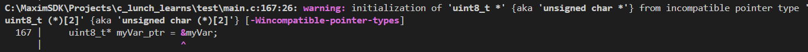
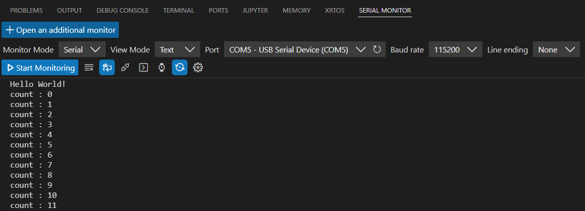
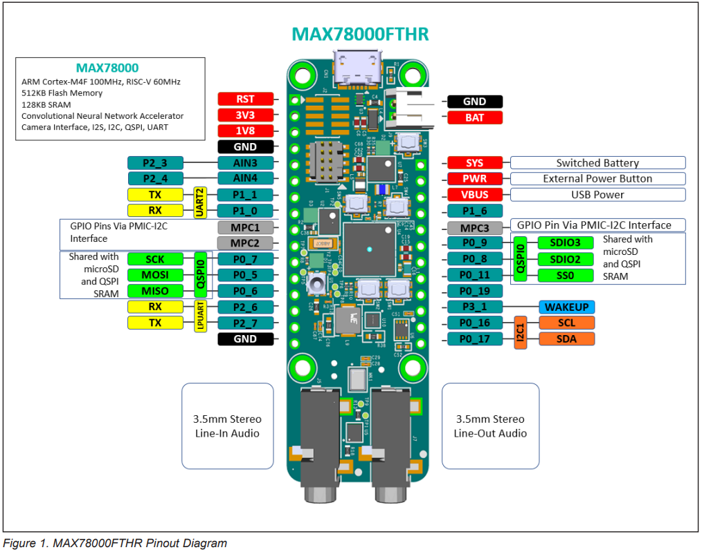

# Table of Contents
- [Day 0 C Programming & Microcontrollers Overview](#day-0-c-programming--microcontrollers-overview)
- [Day 1: Orientation / Setup](#day-1-orientation)
- [Day 2: Introduction to MSDK](#day-2--introduction-to-msdk)
	- [LED/PB Mini-Project](#pbh)


# Day 0: C Programming & Microcontrollers Overview

## C Programming Benchmark
Do this  [[2024.08 C prerequisite check|C prerequisite benchmark >>]]

### Notes

Test your code! 
- I left everything commented out so that you could compile & run as you go.

Do not tolerate compiler warnings!
- Fix warnings when they occur
- Most errors in submitted code were flagged by the compiler!

Useful tool: Windows Calculator (Programmer Mode)
### Fixed-Width Types

Be explicit about your data types when working with bits! (E.g. addresses, registers, bytes, etc.)

Must `#include <stdint.h>`

Unsigned:
- `uint8_t`
- `uint16_t`
- `uint32_t`

Signed:
- `int8_t`
- `int16_t`
- `int32_t`


### Arithmetic
Floating-point vs integer division:

```c
int divide_this = 4;

// Both numbers integers --> Integer result
divide_this / 3;         // 1

// Literal double / float
divide_this / 3.0        // 1.333
divide_this / 3.0f       // 1.333

// Cast any of the numbers to float
float(divide_this) / 3;  // 1.333
```


### Casting

Note that `printf()` implicitly converts type to `double`.
```c
uint16_t x = 0x7EE1;
uint8_t x8 = (uint8_t)x8;    // Convert to 8-bit (Decimal: 225)
                             // Binary: 1110_0001
printf("As a signed number x8 = %d \n", x8); // Does not work as expected
                                             // Outputs 225
// Sign extended from unsigned (uint8_t) as 32-bit double:
// 0000_0000_0000_0000_0000_0000_1110_0001

printf("As a signed number x8 = %d \n", (int8_t)x8 ); // Outputs -31
// Sign extended from signed (int8_t) as 32-bit double:
// 1111_1111_1111_1111_1111_1111_1110_0001
```


### Bit Manipulations

#### Consider Using Hexadecimal Output
Recommend using hexadecimal output (`%x`) for bit manipulations. This is easier to follow than decimal, for example:

| Hex  | Binary      | Decimal |
| ---- | ----------- | ------- |
| 0xFE | `1111_1110` | 254     |
| 0x0E | `0000_1110` | 14      |

`0xFE` and `0x0E` look similar and form a clear relationship, whereas in decimal, it isn't clear how 254 and 14 relate.

#### Write Hex Values With Leading `0x`

Recommend writing hex values with a `0x` prefix to denote hexadecimal. Consider:

`The value of the variable is: 3003`

Depending on the `printf()` statement, this variable is either:
- 3003 (decimal)
- `0x3003` -> 12291 (decimal)

If we always prefix hexadecimal output with `0x`, we will always know the base.
```c
uint16_t knownValue = 0x3003;
printf("The value of this variable is: 0x%x \n", knownValue); // Prints 0x3003
printf("In decimal, this is %u \n", knownValue); // Prints 12291
```

#### Bit Set & Clear

This will be very important! Let's get good at setting and clearing individual / collections of bits.

```c
/* Setting Bits */

// Set bit 0
x = x | (0x01);

// Set bit 1
x = x | (0x01 << 1);

// Set bit 2
x = x | (0x01 << 2);

// Set bit 3
x = x | (0x01 << 3);

// In general: you can shift N positions to target that bit.

// You can even set multiple bits:

// Set bits 5 and 4
x = x | (0x03 << 4);   //  0x03        = 0000_0011
                       // (0x03 << 4)  = 0011_0000 


/* Clearing Bits */

// Clear bit 0
x = x & ~(0x01);        //   0x01  = 0000_0001
						// ~(0x01) = 1111_1110
						// It clears the bits you target in parenthesis.

// Clear bit 1
x = x & ~(0x01 << 1);    //  (0x01 << 1) = 0000_0010
                         // ~(0x01 << 1) = 1111_1101

// Clear bit 2
x = x & ~(0x01 << 2);

// Clear bits 5 and 4
x = x & ~(0x03 << 4);   //   0x03       = 0000_0011
						//  (0x03 << 4) = 0011_0000
						// ~(0x03 << 4) = 1100_1111
```

Specifying bit "sets" (`1`) and "clears" (`0`) as a single number (e.g. `1110_0011` to set bits 7, 6, 5, 1, and 0) is called a **mask**.

### Arrays

#### Easier Initialization

Two ways to pre-initialize arrays to 0:
```c
// Mass initializations
int myArray[5] = {0};

// Individual initialization
int myArray2[5] = {0, 0, 0, 0, 0};
```


#### Char* From String

C processes strings and automatically converts them to arrays:
```c
char* word = "Hello";    // Stores as {'H', 'e', 'l', 'l', 'o'};`
```


#### You (Probably) Don't Want An Array Of Pointers

This code creates an array of `char` pointers, instead of the intended array of `char`:
```c
char* char_array[6] = "Hello";  // Creates an array of 5 char* (pointers to chars)
```

Either:

```c
char char_array1[6] = "Hello"; // Explicit array sizing — use this to make a larger array
char* char_array2 = "Hello";   // Implicitly sizes the array
```


### Pointers

#### Arrays as Pointers

This gives a warning:

```c
char myVar[] = {0xAA, 0x55};
uint8_t* myVar_ptr = &myVar;
```

`myVar` is an array, which C treats as a _pointer to_ the start of the array. For non-arrays, it would be correct to use `&` operator. With arrays, the correct way to do this is:

```c
// Method 1: myVar already points to the array 1st element!
uint8_t* myVar_ptr = myVar;

// Method 2: Get address of 1st element (which is also myVar)
uint8_t* myVar_ptr = &myVar[0];
```

The compiler warning indicates the problem, as well as how to fix it. (Don't ignore compiler warnings!)



#### Pointer Indexing

C indexes addresses by pointer size. Therefore, to move to the next element of an 8-bit array:

```c
uint8_t myArray[2] = {0x00, 0x01};
uint8_t* myPtr = myArray;  // Points to first memory address of myArray
myPtr = myPtr + 1; // Points to 2nd element of myArray

// This will not work properly
myPtr = myPtr + 8;
```

The only time you need to be explicit about the number of bits is when C does not know that it is dealing with a pointer:

```c
uint32_t myPtrVal = myArray;  // myPtr holds the integer value of myArray's address
myPtrVal = myPtrVal + 32;       // myPtr holds the integer value of myArray[2]'s address
uint32_t* myPtr = (uint32_t*)myPtrVal;   // Cast to pointer, points to myArray[2]
```

### Functions

Do not place functions inside of `main()` as such:

```c
/* DO NOT DO THIS!! */
int main()
{
	// Function definition inside of main()
	uint8_t isNonZero(uint32_t input) 
	{
		return (input !=0) ? 1 : 0;
	}
	printf("5 is non-zero?  %u \n", )
}
```


Instead, place functions above or below `main()`. 

```c
/* Function Prototype */
uint8_t isNonZero(uint32_t input);

/* Function Definitions */
uint8_t isNonZero(uint32_t input) 
	{
		return (input !=0) ? 1 : 0;
	}

/* Main Program */
int main()
{
	printf("5 is non-zero?  %u \n", isNonZero(5) );
}

```

Standard practice in MSDK is to place `main()` at the bottom of the file:


# Day 1: Orientation

## Scheduling
Mon / Tues / Wed: Day 1-3
Thurs / Fri: (Unofficial) Days 4-5

RF Training will have Days 4-5 officially.

## Checkpoint for Day 0 Activities
Having done the prep and pre-lab for this series, let's ensure that everyone is set up at the same point:

C Programming:
- [x] Review C Programming Benchmark assignment

### Preparation for Training
[[2024.08.12 micros setup pre-work for ncgs]]

Hardware:
- [ ] MAX32670
- [ ] MAX78000
- [ ] MAX31723PMB1 Temperature Sensor
- [ ] 6 Jumper wires
- [ ] USB connector / adapter to demo boards

Software (Environment):
- [x] Verify Maxim PATH in MinGW (`C:/MaximSDK/Tools/MSYS2/msys.bat`)
	- Know where to find this in Explorer!
	- `arm-none-eabi-gcc -v`
	- `arm-none-eabi-gdb -v`
	- `make -v`
	- `openocd -v`
- [x] Build `Hello_World` in VS Code (`MaximSDK/Examples/MAXxxxxx/Hello_World`)
	- Check `/build` directory to verify existence of these files:
		- `HellowWorld.elf`
		- `Hello_World.map`
		- `*.d` (dependency) files
		- `*.o` (object) files

## Slides: Microcontrollers Overview
- Registers
- Architecture
- ADI's MAXIM Microcontrollers

## Lab
- Solder headers
- Report any issues

# Day 2:  Introduction to MSDK

## Running Code on a Microcontroller: Hello World!

Our first task will be to open a basic "Hello World" example and inspect the project; then, we'll walk through the entire build process to flash `Hello_World` onto the MAX78000FTHR board.

### Hello_World in VS Code

Open the MAX78000 Example `Hello_World` in VS Code.

- **From VS Code:** File -> Open Folder -> `MAX78000/Hello_World`
- **From File Explorer:** Right-click -> "Open with Code"
	- If this option does not appear, you can get it by re-installing VS Code and enabling context menu support.

Every example project folder has the following files & folders which you should locate:

- `main.c`: This is the main program. Write your code here.
- `.vscode/`: Holds project-specific configuration files.
- `Makefile`: This file defines all build tasks for VS Code (`make`, really). **Do not edit.**
- `README.md`: Documentation for the project, including description, build notes, setup, and expected output.

Opening `main.c`, every project's code will follow a similar structure:

1. Boilerplate legal stuff
2. Filename, `@brief` description and further `@details`. Read this.
3. Definitions
4. Globals
5. Functions
6. Main()

Read through the code in `main()` and verify you understand its purpose. Don't worry about how various function calls work internally; just have an idea what you expect to have happen.

> [!question] Checkpoint
> 1. What do you expect to happen?
> 2. What files are included? Which of these are built-in libraries?

#### Build Tasks

Every Example project is pre-loaded with a `Makefile` that enables "build tasks" to automate interaction with the project & microcontroller. This `Makefile` is executed with GNU[^gnu] Make, a program that executes other command-line programs. It's basically a high-level scripting tool, and is used to provide a "recipe" for build systems. 

Build tasks consolidate the compiler workflow — a single `make` command automatically specifies all of the important `.c` and `.h` files that a project depends on, invoking the compiler with the required command-line arguments to produce an output file (`build/Hello_World.elf`).

From the top menu ribbon, click on `Terminal` -> `Run Build Task` to see a list of 6 possible options:

- `build`: Builds the entire project. Creates the binary (.ELF file) that is loaded onto the microcontroller.
- `flash`: Loads ("flash") the program onto the microcontroller, pauses execution.
- `flash-and-run`: Loads ("flash") the program onto the microcontroller, proceeds to execution.)
- `clean`: Deletes the output folder & files from the `build` task.
- `clean-periph`: Deletes _all_ files, including peripheral drivers.
- `erase flash`: Completely erases all application code in flash memory. Useful for recovery from bad firmware.

These task calls are listed in `.settings/tasks.json`.

#### Board Support Packages

The MAX78000 IC is used in a variety of demo and evaluation boards, each with different hardware and layouts (e.g. the cameras, USB ports, buttons, LEDs, etc. listed on each line of `build` output) — therefore, it's important to target the right platform. This is accomplished through the use of [Board Support Packages (BSPs)](https://analogdevicesinc.github.io/msdk//USERGUIDE/#board-support-packages), which manage board-level hardware that varies between evaluation platforms. 

We can see which platform our project is targeting by referencing the `.vscode/settings.json` — by default, MAX78000 Examples target the evaluation kit:

```make
    "target":"MAX78000",
    "board":"Ev_KitV1",
```

We can target the FTHR board instead by modifying the `board` field:

1. Open `.vscode/settings.json`
2. Change the `board` parameter (line 18) from "EvKit_V1" to "FTHR_RevA"
3. Save -> `Ctrl+Shift+P` -> `Developer: Reload Window`

From the MSDK User Guide:
> The first task when opening or creating any project is to ensure the BSP is set correctly.

If your project compiles and flashes properly, but does not respond as you expect, be sure to check that the BSP targets your platform.

#### Build, Flash, and Run

1. Plug in the MAX78000FTHR to your computer.
3. Clean the project (`Terminal (Ctrl+Shift+B)` -> `Run Build Task` -> `clean`)
	1. Follow the same steps to run the build task `clean-periph`
4. Build the project (`Run Build Task` -> `build`).
5. Flash & run (`Run Build Task` -> `flash & run`).

The MAX78000 will run "Hello World", which outputs an incrementing `count` value over the serial port. In order to view this output, install the [Serial Monitor](https://marketplace.visualstudio.com/items?itemName=ms-vscode.vscode-serial-monitor) extension. Change the `Port` to the MAX78000 (usually `COMn` — try multiple if you don't know which one) and click `Start Monitoring` to see the microcontroller's serial output.

> 

Magic, right?

Not exactly. Although we'll avoid diving into the intricacies of how build tasks work, we can investigate the anatomy of `build` to understand what `make` handles at a high level. In the process, we'll begin to reveal the underlying structure of MSDK and learn how it works.


> [!question] Checkpoint
> Where could you find documentation on MSDK build tasks?

### Understanding Build
The `build` task invokes the following command:

> `Executing task: make -r -j 8 --output-sync=target --no-print-directory TARGET=MAX78000 BOARD=FTHR_RevA MAXIM_PATH=C:/MaximSDK MAKE=make PROJECT=Hello_World`

This runs the `Makefile` included in the project folder, passing the additional arguments specified above. 

- `TARGET=MAX78000 BOARD=FTHR_RevA` As mentioned previously in "Board Support Packages", the build process targets a specific platform. In this case, these arguments allow us to verify that Make is correctly configured to target the FTHR board for this project.

- `MAXIM_PATH=C:/MaximSDK MAKE=make PROJECT=Hello_World` From installing MSDK, you should be familiar with the Maxim SDK folder being located at C:/MaximSDK! The final arguments are not very important to cover, but should make intuitive sense.

#### Make Output

Make's `build` output is extremely long and can be overwhelming at first glance; however, take a moment to examine it. What do you see?

> 		- MKDIR /c/MaximSDK/Examples/MAX78000/Hello_World/build
> 		- MKDIR C:/MaximSDK/Libraries/PeriphDrivers/bin/MAX78000/softfp
> 		- CC C:/MaximSDK/Libraries/CMSIS/../PeriphDrivers/Source/SYS/mxc_assert.c
> 		- CC main.c
> 		- CC C:/MaximSDK/Libraries/MiscDrivers/LED/led.c
> 		- CC C:/MaximSDK/Libraries/MiscDrivers/stdio.c
> 		- CC C:/MaximSDK/Libraries/MiscDrivers/PushButton/pb.c
> 		- CC C:/MaximSDK/Libraries/Boards/MAX78000/FTHR_RevA/Source/board.c
> 		- ...
> 		- CC C:/MaximSDK/Libraries/CMSIS/../PeriphDrivers/Source/GPIO/gpio_reva.c
> 		- CC C:/MaximSDK/Libraries/CMSIS/../PeriphDrivers/Source/GPIO/gpio_ai85.c
> 		- CC C:/MaximSDK/Libraries/CMSIS/../PeriphDrivers/Source/I2C/i2c_me17.c
> 		- CC C:/MaximSDK/Libraries/CMSIS/../PeriphDrivers/Source/ICC/icc_me17.c
> 		- CC C:/MaximSDK/Libraries/CMSIS/../PeriphDrivers/Source/ICC/icc_reva.c
> 		- CC C:/MaximSDK/Libraries/CMSIS/../PeriphDrivers/Source/I2S/i2s_ai85.c
> 		- LD /c/MaximSDK/Examples/MAX78000/Hello_World/build/Hello_World.elf

First, notice the patterns throughout the output that simplify its meaning:

- Every line starts with either `MKDIR` (make directory) or `CC` (C compiler)
	- The first line, for example, creates the `build/` directory — this is where we saw the output from our `build` task previously.
- Each line begins with `C:/MaximSDK/Libraries...`, so we can skip over that.
	- The only exceptions are `main.c`, which is inside of our project folder; and the `Examples` folder, which corresponds to the location of the `Hello World` project itself.
- Similarly, all of the files listed either belong to `MiscDrivers`, `PeriphDrivers`, `CMSIS`, or `Boards`.

It helps to think of each directory in the hierarchy as levels of classification. Already, we have insight into the underlying structure of the MSDK's library. (This will be useful to consider when we begin writing code that extends functionality from this toolchain.)

While we're here, let's examine a few specific lines of output from each hierarchical folder to understand their purpose:

> `CC main.c`

This is our program code! As our only local `.c` file, it alone lacks any folder prefix (`C:/MaximSDK...`) in the `make` output. 

The `Hello_World` `Makefile` (which you can open in the project folder — look near line 130) specifies which project folder files are included, in the following excerpt:

```
# The following paths are searched by default, where "./" is the project directory.
# ./
# |- *.h
# |- *.c
# |-include (optional)
#   |- *.h
# |-src (optional)
#   |- *.c
```

If we had more files than `main.c`, we would also see these listed in the `build` task output.

> `CC C:/MaximSDK/Libraries/MiscDrivers/stdio.c`
> `CC C:/MaximSDK/Libraries/MiscDrivers/LED/led.c`
> `CC C:/MaximSDK/Libraries/MiscDrivers/PushButton/pb.c`
> `CC C:/MaximSDK/Libraries/CMSIS/../PeriphDrivers/Source/GPIO/gpio_reva.c`

These files contain definitions (aka "drivers") for all of the possible commands we can invoke to control the microcontroller. The filenames can be obscure abbreviations, but again we can refer to the folder hierarchy to understand their functionality.

- `stdio.c` redefines the `printf()` function to use the serial terminal
- `led.c` defines LED commands to enable LED functionality, and turn them on/off
- `pb.c` defines pushbutton commands, for example to get the state of a pushbutton or detect a button press
- `gpio_reva.c` defines GPIO commands to configure GPIO ports and get/set their status

Look at the complete output of your terminal's `build` command, and you'll see many more files (e.g. for ADC, I2C, I2S, UART) included in the build — all following the same format. 

Don't worry if some of these are unfamiliar; we'll soon develop our ability to work with any library we need. The point, for now, is to understand that each library sources its drivers from a simple hierarchy of "Miscellaneous" and "Peripheral" drivers, all contained within MSDK in the `C:/MaximSDK/Libraries` folder.

> `CC C:/MaximSDK/Libraries/Boards/MAX78000/FTHR_RevA/Source/board.c`

This is our board support package (BSP). We took care of this earlier when we modified  `.vscode/settings.json` from `EvKit_V1` to `FTHR_RevA`, changing target platforms to reflect our usage of the MAX78000FTHR evaluation board. The output above shows us that the `make` is using the `board.c` file from the `FTHR_RevA/Source` folder, instead of the _similar, but very different_ `EvKit_V1` or other folder. 

> `LD /c/MaximSDK/Examples/MAX78000/Hello_World/build/Hello_World.elf`

This final line in the chain is a linker (`LD`) command, and shows the path to the executable that we will load (flash) onto the microcontroller. This file has a `.elf` (executable & linkable format) extension, and is located in our project's `build` directory.

This folder also contains all of the object files (`*.o`) that are linked into the final executable, as well as a `.map` file which confers specific memory addresses for the final executable's instructions. 

(Map files are beyond the scope of this series, but are very interesting and complex! Just know that a map file exists alongside the ELF file, and it maps object files into memory space specific to the microprocessor.)

#### ARM Toolchain
The final output from the `build` command hints at the underlying ARM toolchain invoked by `make` for compilation.

> `arm-none-eabi-size --format=berkeley /c/MaximSDK/Examples/MAX78000/Hello_World/build/Hello_World.elf`

The specific `arm-none-eabi-size` command is not particularly important (it outputs the size of the `Hello_World.elf` file); however, it is important to recognize the structure of `arm-none-eabi` for its usage throughout MSDK.

Executable files output by a compiler must be targeted for a particular instruction set architecture (ISA). (This refers to the prescribed structure of instructions that a given processor expects — the literal meaning of 1's and 0's contained in the final program executable.) For example, we cannot expect code compiled for a laptop's x86 processor to run on an ARM Cortex M4 chip! 

Because the MAX78000 (and the majority of microcontrollers) use ARM M4 microprocessors, we must _cross-compile_ for ARM's defined ISA, using their suite of GNU[^gnu] tools: the [ARM GNU Toolchain](https://developer.arm.com/Tools%20and%20Software/GNU%20Toolchain). 

[^gnu]: GNU refers to a powerful set of free, open-source software tools that are ubiquitously used in microcontroller development. Our most frequently-used GNU tools will be gcc (the GNU C compiler) and gdb (GNU debug).

The command `arm-none-eabi` describes the specific ARM GNU toolset invoked for programming M4 chips, following the naming scheme:

- `arm` = ARM
- `none` = There is no operating system on this microcontroller!
- `eabi` = Embedded Application Binary Interface

You will see this prefix frequently throughout your work with the MSDK — it helps to remember that it simply specifies the ARM variant of various embedded development tools!

## A Tour of `C:/MaximSDK`
Happily, the `MaximSDK` folder contains the entirety of the MSDK toolchain. This means that everything — from core tools like GNU to VS Code! — can be located inside of it. Now that we've seen how some of these tools are used, we can explore its fundamental structure.

At the root level, the MSDK contains 6 folders. (Not all of these need your attention or an explanation.)
- `Documentation`: Documentation for working with the SDK. Note that this does _not_ include microcontroller documentation (e.g. datasheet or user guide).
- `Examples`: Useful example files! We'll visit this in a moment.
- `installerResources`
- `Libraries`: Contains all of the drivers we've seen — miscellaneous (external) and peripheral (internal) — as well as all board support packages (BSPs).
- `Licenses`
- `Tools`: Contains all of the GNU tools (including Make and all `arm-none-eabi` utilities like GCC, GDB, etc.). This is also where VS Code lives!

The root folder also contains `MaintenanceTool.exe`. Use this to update, reinstall, or uninstall MSDK — it's especially useful if you accidentally modify the `MaximSDK` folder and need a fresh install!

> [!question] Review Questions
> 1. Can you explain what each folder is for?
> 2. What is a board support package? Where is it located?
> 3. What file contains the program binary for the microcontroller? Where is it located?
> 4. How should you know if a library is miscellaneous or peripheral?
> 5. What is the point of the `setenv.bat` file in the root folder?
> 6. Can you run tools directly from their `Tools` folder?

## Example Project: GPIO
We have already run one of the example projects and seen how the underlying MSDK supports this. Let's apply this new knowledge to run another simple example — find the `GPIO` example project and open the folder in VS Code.

> [!warning]
> 
> First step with any new project: make sure the BSP is set.
> 
> 1. Open `.vscode/settings.json`
> 2. Target the FTHR platform by modifying the target board:  
> 	- `"board":"FTHR_RevA"`
> 3. Save, then `Ctrl`+`Shift`+`P` -> `Developer: Reload Window`

As with "Hello World", read through the `readme` and `main.c` code. This example is different and more complex than `Hello_World` in a few ways.

First, this code contains definitions and functions prior to `main()`. As a general rule, you can skim over these and simply note the names — more useful to know _that_ they exist instead of worrying about their internals.

> [!tip] Definitions
> Definitions allow programmers to `#define` text replacements for the compiler. This simplifies code — for example, by allowing you to refer to `MXC_GPIO_PORT_OUT` and `MXC_GPIO_PIN_OUT` instead of wondering _which_ of the many GPIO ports and pins you need.

Secondly, this code uses a special data type, called a struct, for GPIO configuration. We haven't learned these yet, so don't worry if this looks confusing. Two tools will help you in these situations:

1. Read all of the `printf()` outputs.
2. Read all of the comments.

Because `printf()` is intended to communicate important status information to the user, you can frequently leverage `printf()` output to understand a program's functional blocks. Comments work the same way (but are more of a gift, considering the program would run the same way without them!) and can be used similarly.

Read everything!

You should be able to understand the basic functionality & flow of the code.

> [!question] Checkpoint
> Do you understand the code? What do you think it does?

### Build, Flash & Run
As with `Hello_World`, we can build, flash, and run this project on the MAX78000. 

However, in order to observe and interact with this example fully, we need a bit more information. The Serial Monitor outputs the `printf()` lines from `main()`:

> ***** GPIO Example *****
> 
> 1. This example reads P1.7 (SW2 input) and outputs the same state onto
>    P2.0 (LED1).
> 2. An interrupt is set to occur when SW1 (P0.2) is pressed. P0.9 (SDIO3 pin
>    on header J4) toggles when that interrupt occurs.

What are these pins and how can we find them?

Technically, each port/pin (written in the format "Px.y", as in "Port X, pin Y") can be found in the [MAX78000 datasheet](https://www.analog.com/en/products/max78000.html) and located on the IC. However, because we are dealing with the FTHR evaluation board — which is a specific board implementing the MAX78000 — we should look in the [MAX78000FTHR datasheet](https://www.analog.com/en/resources/evaluation-hardware-and-software/evaluation-boards-kits/max78000fthr.html#eb-overview). 

Page 3 shows the MAX78000 header pinout:


(This header pinout is also listed on the card that comes with the evaluation board, and the silkscreen also has useful information — however, note that there are errors occasionally, and the online datasheet will always be the most up-to-date.)

Only the ports/pins shown on the headers are broken out; all other pins are either inaccessible, or routed directly to hardware. 
- P0.2 (SW1) and P1.7 (SW2) are only accessible from the physical buttons
- P2.0 (LED1) routes directly to the LED
- P0.9 (SDIO3) is broken out to a header pin
 
Press SW2 to make the LED light up. You can also connect an oscilloscope or multimeter to SDIO3 to see it toggle as your press SW1.

> [!tip]
> Kill power to your microcontroller whenever altering any physical connections. A single short circuit can break your board!)

Always consider checking the `Examples` folder when exploring new functionality! These projects quickly get you to a working demo that showcases how to get started, which can be very useful for tackling unfamiliar situations. 

## Documentation Resources
There are 5 places to find any Maxim microcontroller's documentation; the first level of categorization concerns whether the topic is more related to hardware or software:

- **Hardware:**
	- [Datasheet](https://www.analog.com/media/en/technical-documentation/data-sheets/MAX78000.pdf)
		- [Errata Documentation](https://www.analog.com/media/en/technical-documentation/data-sheets/max78000_a1_errata_sheet_rev_0.pdf)
	- [User Guide](https://www.analog.com/media/en/technical-documentation/user-guides/max78000-user-guide.pdf)
	- [Demo Board Datasheet](https://www.analog.com/media/en/technical-documentation/data-sheets/MAX78000FTHR.pdf)
- **Software:**
	- [MSDK User Guide](https://analogdevicesinc.github.io/msdk//USERGUIDE/)
	- Maxim Peripheral Driver API
	- Examples Folder *(unofficial "documentation"!)*

The ability to correctly guess the locations of various information amongst all of this documentation is a skill that is honed by practice. As you gain familiarity with what topics each document deals with, you'll build intuition about which documentation may be relevant to your search.

In addition to the above hardware/software distinction, there are some additional heuristics you can apply to classify various documentation resources.

**Hardware Heuristics**
- The **Datasheet** details electrical and hardware specifications.
	- Examples: clock speeds, pin configurations, and memory specs
- The **User Guide** details the logical flow and inner workings of the microcontroller.
	- *"How can I make the system clock use a different oscillator?"*
	- *"What is the base address of the I2C peripheral?"*
	- *"What is the relationship between ADC values and voltage?"*
	- *"What bits must be set to enable GPIO output on P0.7?"*
- The **Demo Board Datasheet** (e.g. MAX78000FTHR) details the specific implementation of the microcontroller *to a particular board*.
	- Examples: Header pin mappings, switch and LED locations, onboard peripherals (e.g. SD cards or headphone jacks)
	- This document also usually contains the **schematic**

**Software Heuristics**
- The **MSDK User Guide** gives step-by-step instructions to configure your environment (VS Code) and do basic tasks (e.g. flashing new code).
	- This is also where you can find broader development information, such as [die types](https://analogdevicesinc.github.io/msdk//USERGUIDE/#die-types-to-part-numbers) and [available BSP specifiers](https://analogdevicesinc.github.io/msdk//USERGUIDE/#board-support-packages).
- We haven't needed the **Maxim Peripheral Driver API** documentation yet; however, this provides a high-level programming interface to control microcontroller hardware using simpler function calls. The documentation will be essential for using this API effectively.
- The **Examples** folder, as we've seen already, is the fastest way to get a working demo when exploring new functionality.


### Documentation Hunt
The following questions pertain to the MAX78000 (and FTHR board, where applicable):

[[Microcontrollers Documentation Hunt]]


# Programming with MSDK & Peripheral APIs

Now that we've explored the SDK's structure and how everything functions behind the scenes, it's time to shift focus toward writing our own code!

For this project, our goal is to create a simple pushbutton LED. We'll start by using the libraries provided by the FTHR board's BSP, and then gradually replace them with lower-level API calls that interact directly with device memory and addressing.

Here's what we'll cover:

1. Writing code using the FTHR BSP
2. The `struct` & `enum` datatypes
3. API organization and conventions
4. Replacing BSP code with MSDK function calls

Let's get started!

## First Application: Pushbuttons & LEDs (using BSP)

### New Project Setup

The first step when creating any new project with MSDK is to copy an Example workspace from `MaximSDK/Examples/[MAXxxxxx]` to a new folder. Unlike a completely blank project, these examples are pre-configured to make VS Code work with a given microcontroller. We'll use the "Hello World" project as a mostly-blank canvas to develop our program.

You can place the folder anywhere, but I like to make a separate folder called `Projects` under `C:/MaximSDK/Projects` and place my project folders there. (Important: The file path **cannot** have spaces in it!)

Copy the MAX78000's "Hello World" folder from `MaximSDK/Examples/MAX78000/Hello_World` to `MaximSDK/Projects/Pushbutton_LED`, then open the folder in VS Code.

As with the last example, verify that the project targets the correct board support package, using the `.vscode/settings.json` file. 

Flash and run the program on the MAX78000. You will see the "count" increment in Serial Monitor, and the red LED will begin to blink.

Let's explore the code to see what we can learn from this simple example file.

### LED.h

Open `main.c` and look at the code inside `main()`. You might notice that it contains half of the functionality that we'd like in *our* program:

- `LED_On(LED1);`
- `LED_Off(LED1);`

Already, the example has helped us move toward achieving our end goal!

VS Code's _IntelliSense_ links code from across the entire SDK, so we can make use of this now to explore the code further.

1. Hover over the `LED_On()` and `LED_Off()` functions to read their explanations
2. Hover over the `LED1` constant to read its tooltip
	1. You should be able to identify the color (Red/Green/Blue) of `LED1`
3. Right-click on `LED_On()` or `LED_Off()` to explore the top 3 options in the context menu.

	- **Go to Definition** will take you to the C code which implements a particular function. It can be helpful when you need to know _how_ a function works; however, this may be more useful later, and is less practical when familiarizing yourself with a new codebase.

	- **Go to Declaration** will take you to the `.h` header file that holds the function's prototype. In MSDK, this is where all of the high-level comments exist to explain a function call, its arguments, return type, and any notes to be aware of. The header file is also useful for finding other, related functions because they will usually be declared in the same file (and frequently, the same section).
		- Note: When right-clicking an `#include` statement with a given header file, you'll need to use `Go to Definition` to open the header file.
	
	- **Go to Type Definition** is useful when dealing with variables and arguments that are custom types — think structs or enums. MSDK has many different custom data types for use with its function calls. Exploring the type definition reveals its data members, which can help when trying to understand its purpose and functionality.

Let's choose `Go to Declaration` to open `LED.h`. VS Code will open the file at the function prototype for `LED_On()` or `LED_Off()`. Scroll to the top and read through the entire file. Pay attention to:

1. Any comments you see
2. Read the `#define` statements
3. Function prototypes and their purpose (again, read the comments!)

You should have noticed

1. the `#define` for `LED1` (used in `main.c`)
2. the 4 possible LED function calls available
	- `LED_Init()`, `LED_On()`, `LED_Off()`, and `LED_Toggle()`

At this point, you have enough understanding to activate the green LED instead of the red one, and further modify the existing code (e.g. to alternately flash red and green). Try it out!

> [!question] Knowledge Check
> Where do you expect to find the LED.h & LED.c files in MSDK? (Hint: The definitions and functions relate to the _board_, not the MAX78000 itself! Knowing this, where do you expect the driver to be?)

### MXC_Delay.h

We can similarly use `Go to Declaration` to view the header of `MXC_Delay()` and view its related definitions and function calls. Read through the header file, especially the comments. You should notice that the units of `MXC_Delay()` are in microseconds. Additionally, pay attention to the `MXC_DELAY_SEC` and related `MSEC` definitions, which make it easier to specify long time intervals. 

We won't use any "callback", "asyncs", or "interrupts" in this series, so feel free to skip over anything with these terms for now. Additionally, many library files will contain (potentially-confusing) conditional definitions as `#ifdef`. This is commonly seen inside of lower-level libraries, as the same file might be used across _all_ of the MAXxxxxx microcontrollers, yet needs to cater to the functionality of each. In the MAX78000, it is also common to see `#ifdef __riscv`; this indicates code that runs on the RISC-V core (instead of the ARM M4F) of the MAX78000. VS Code _should_ "gray out" any text enclosed by a RISC-V `#ifdef`. We're not using this processor, so you can skip these sections, too. 

Try modifying the code to alternately turn on/off the Red and Green LEDs for 3 seconds each.

```c
// Example implementation in main()
int main(void)
{
    printf("Hello World!\n");

    while (1) 
    {
		// Turn on red LED
		LED_On(LED_RED);
		// Turn off green LED
		LED_Off(LED_GREEN);      

		// Wait 3 seconds
		MXC_Delay(MXC_DELAY_MSEC(3000));

		// Turn off red ("busy") LED
		LED_Off(LED1);
		// Turn on green ("ready") LED
		LED_On(LED2);

		// Wait 3 seconds
		MXC_Delay(MXC_DELAY_MSEC(3000));
    }
}

```

By the way, you might have noticed the introduction of the new `LED_RED` and `LED_GREEN` constants; these come from `board.h` and are mapped inside of the board support package for the MAX78000FTHR. You can `Go to Declaration` to see the corresponding `board.h` definition for yourself. (To be honest, I found these by accident when I tried to `#define` these for myself — VS Code's _IntelliSense_ popped up to indicate they already existed.)

That said, you should always aim to use constants (via `#define` statements) for any "magic" values — values whose meanings aren't clear simply by inspection. For example, the value `0` corresponds to the Red LED, but this should be obvious to a reader without referencing documentation.

```c
LED_On(0);        // Valid, but unclear — which LED is "0"?
LED_On(LED_RED);  // This is much better
```


If a definition does not exist, feel free to make your own under the `/* Definitions */` section of `main.c`!


### Locating Additional Drivers

The "Hello_World" example doesn't use the FTHR board's pushbuttons, so we don't have any provided code to reference for using SW1 and SW2. How are we supposed to know what's available?

You might recall that the GPIO example made use of pushbuttons for user input; however, if you look through the code, the project doesn't call any pushbutton-specific functions. One path forward might be to notice that the `main.c` file contains a single `#include "pb.h"`, which we could use to find the header file (via `Go To Definition`). However, let's find a more reliable solution.

Similar to the LEDs, the pushbuttons are board-specific — they're not an inherent part of the MAX78000 IC, and there's nothing which requires the microcontroller to use its GPIO pins for LEDs or pushbuttons (nor even to _have_ these peripherals in the first place!). Therefore, any code supporting these parts can be found inside the `MaximSDK/Libraries/MiscDrivers` folder, for example:

- `MaximSDK/Libraries/MiscDrivers/LED/led.h`
- `MaximSDK/Libraries/MiscDrivers/PushButton/pb.h

Support files such as in `LED` and `PushButton` are called **drivers**. In general, drivers enable functionality which you would otherwise need to code yourself.

In fact, now is a good time to explore the `MiscDrivers` directory more fully, to take stock of the various _external_ peripherals the SDK natively supports.Some of these folders, like `LED` and `PushButton`, are general-purpose and work on all ADI demo boards that feature this hardware. Other drivers may be specific to particular demo board / hardware combinations. Part-specific hardware drivers are indicated by their filename; for example, the header file enabling the MAX78000FTHR's audio codec (connected to the 3.5mm audio jacks) is located at `MaximSDK/Libraries/MiscDrivers/CODEC/max9867.h`. 

There's a good chance that any demo board peripherals you want to use have drivers located in the `MiscDrivers` directory, so look here first. Even if they don't provide the exact functionality you may need, they are excellent resources to use as templates.

> [!question] Self-Test
> Where can you look up the part number for a peripheral on your demo board?

> [!tip]
> You can sometimes use VS Code's _IntelliSense_ (and a little intuition) to guess the right header file to include. For example, typing `#include "max` provides a tooltip which suggests available options; one of these (for the codec example above) is `max9867.h`.

### PB.h

Let's add an `#include "pb.h"` to our project's `main.c` file. Now we can `Go to Definition` to explore the header file. Again, read through it (skipping any references to "callbacks" or "interrupts", for now) and note which functions we can use:

* `PB_Init()` initializes all push buttons
* `PB_Get()` gets the current state of a push button
* `PB_IsPressedAny()` checks if any button is currently pressed

Try adding SW1 or SW2 functionality to your project; using the `PB.h` driver functions, this can be done in a few lines.

> [!question] Self Test
> Make a program infinite-loops between a "ready" and user-activated "busy" state:
> 
> - Light the Green LED ("ready")
> - On user input to the SW / Pushbutton...
> 	- Turn off the Green LED
> 	- Turn on the Red ("busy") LED for 3 seconds
> 	- Then return to "ready" (green LED)
> 	- Output `"Ready"` to the console.
> - Avoid "magic" values — `#define` your SW1 / SW2


Here is an example of the finished project using BSP drivers; it shines the Green LED as a "ready" indicator, then shines the Red LED ("busy" indicator) for 3 seconds when SW1 is pressed, before returning to "ready". 

```c
/* Definitions */
// Switches (Pushbuttons) — AVOID MAGIC VALUES! :)
#define SW1 0
#define SW2 1


/***** Globals *****/

/***** Functions *****/

// *****************************************************************************
int main(void)
{
    printf("Hello World!\n");

	// Infinitely loop the program
    while (1) 
    {
        // Check SW1 status
        int pbStatus = PB_Get(SW1);

        // Check if PB switch is pressed.
        if (pbStatus == 1) 
        {   
            // Turn on red LED
            LED_On(LED_RED);
            // Turn off green LED
            LED_Off(LED_GREEN);
            
            // Wait 3 seconds
            MXC_Delay(MXC_DELAY_MSEC(3000));
        }
        else
        {
            // Turn off red ("busy") LED
            LED_Off(LED1);
            // Turn on green ("ready") LED
            LED_On(LED2);
        }
    }
}
```


